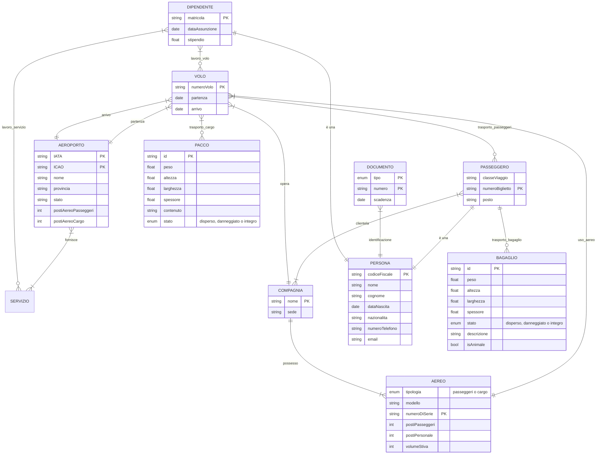

<h1 align="center"> Gestione aeroportuale </h1>

 2024-12-27 

    Diego Barbieri  
    0001080333  
    diego.barbieri5@studio.unibo.it  

    Ivan De Simone  
    0001069314  
    ivan.desimone@studio.unibo.it  

# Indice

- [Indice](#indice)
  - [Analisi dei requisiti](#analisi-dei-requisiti)
    - [Requisiti in linguaggio naturale](#requisiti-in-linguaggio-naturale)
    - [Glossario dei termini](#glossario-dei-termini)
    - [Eliminazione delle ambiguità](#eliminazione-delle-ambiguità)
    - [Strutturazione dei requisiti](#strutturazione-dei-requisiti)
    - [Specifica operazioni](#specifica-operazioni)
  - [Progettazione concettuale](#progettazione-concettuale)
    - [Identificazione delle entità e associazioni](#identificazione-delle-entità-e-associazioni)
    - [Scheletro dello schema ER (approccio top-down)](#scheletro-dello-schema-er-approccio-top-down)
    - [Sviluppo delle componenti (approccio inside-out)](#sviluppo-delle-componenti-approccio-inside-out)
    - [Unione delle componenti](#unione-delle-componenti)
    - [Dizionario dei dati](#dizionario-dei-dati)
  - [Progettazione logica](#progettazione-logica)
    - [Tavole dei volumi e delle operazioni](#tavole-dei-volumi-e-delle-operazioni)
    - [Ristrutturazione schema concettuale](#ristrutturazione-schema-concettuale)
    - [Normalizzazione](#normalizzazione)
    - [Traduzione verso il modello fisico](#traduzione-verso-il-modello-fisico)
  - [Codifica SQL](#codifica-sql)
    - [DDL](#ddl)
    - [DML](#dml)
  - [Testing](#testing)
  - [Riferimenti](#riferimenti)

## Analisi dei requisiti

### Requisiti in linguaggio naturale

Si vuole realizzare una base di dati per la gestione di aeroporti italiani, con particolare attenzione alla gestione dei voli, dei passeggeri, dei lavoratori e dei servizi connessi. Nello specifico, si vuole memorizzare informazioni riguardanti aerei di tipologie cargo e passeggeri, i voli che essi effettuano, le merci e i passeggeri che viaggiano su di essi, i lavoratori che operano negli aeroporti e i servizi offerti da questi ultimi.

Per gli aeroporti sarà necessario mantenere il codice identificativo IATA e ICAO, il nome completo, la provincia e lo stato di appartenenza, il numero di posti aereo, separati in passeggeri e cargo. Oltre a ciò è fondamentale memorizzare i servizi offerti e i servizi di sicurezza. Riguardo gli aerei si vuole memorizzare la tipologia (passeggeri o cargo), il modello, l'identificativo, la compagnia aerea che lo possiede e la capienza.

Per quanto riguarda la gestione dei voli passeggeri, si vogliono memorizzare informazioni sui passeggeri tra le quali generalità (nome, cognome, data di nascita, nazionalità, un recapito telefonico e un indirizzo email), le compagnie aeree di cui sono clienti insieme al numero di km viaggiati con esse, i loro documenti di identità registrati ed i bagagli che trasportano. I bagagli si suddividono in bagagli a mano e bagagli da stiva. Di entrambi si vuole memorizzare il peso, le dimensioni (altezza, larghezza e spessore) e lo stato (disperso, danneggiato o integro). Dei bagagli da stiva si vuole inoltre mantenere una breve descrizione e un flag se è un animale. I voli devono essere memorizzati con il numero di volo, la data e l'ora di partenza e di arrivo, la compagnia aerea che lo opera, l'aereo utilizzato, l'aeroporto di partenza e di arrivo ed il personale a bordo.

Per quello che riguarda i voli cargo, si vogliono memorizzare numero di volo, data e ora di partenza e di arrivo contestualmente all'aeroporto, la compagnia logistica che lo opera, l'aereo utilizzato, il personale a bordo ed informazioni sul carico trasportato. Nello specifico, dei singoli pacchi si vuole memorizzare il peso, dimensioni (altezza, larghezza e spessore), contenuto e stato (medesimo del bagaglio).

La base di dati deve inoltre tenere traccia di tutti i dipendenti, distinguendo tra lavoratori degli aeroporti e lavoratori delle compagnie aeree/logistiche. I lavoratori presentano generalità uguali a quelle dei passeggeri, ma si vuole memorizzare anche dove lavorano, il ruolo che essi ricoprono e il loro stipendio.

Tra i servizi offerti dagli aeroporti si vuole memorizzare informazioni riguardanti le lounge, i parcheggi, i ristoranti e i negozi. Delle lounge si vuole mantenere la compagnia aerea che la mette a disposizione ed i posti disponibili. Dei parcheggi si vuole memorizzare l'ubicazione, il numero di posti disponibili, il costo orario ed il numero di posti occupati. Sarà inoltre necessario salvare tutti i servizi di trasporto che collegano l'aeroporto ai servizi esterni ad esso ed alle ulteriori infrastrutture urbanistiche. Dei ristoranti e dei negozi si vuole memorizzare il nome e il tipo di cucina o merce venduta. Gli esercizi commerciali possono essere gestiti da terzi, in tal caso si vuole memorizzare il nome del gestore. Per tutti i servizi è cruciale memorizzare i dipendenti.  I servizi di sicurezza devono essere memorizzati separatamente. Più precisamente, si vuole memorizzare il nome del servizio, il tempo medio di attesa e il numero di addetti, facendo distinzione tra addetti di sicurezza e addetti di controllo.

### Glossario dei termini

| Termine | Descrizione | Sinonimi | Collegamenti | 
| --------------- | --------------- | --------------- | --------------- | 
| Aeroporto | stazione di transito di aerei | - | Volo, Lavoratore, Servizio |
| Volo | transito tra due aeroporti distinti | viaggio | Aeroporto, Aereo, Lavoratore |
| Volo passeggeri | volo che trasporta persone | - | Volo, Passeggero, Compagnia aerea |
| Passeggero | cliente per una compagnia aerea, presente su almeno un volo | cliente | Volo passeggeri, Identità |
| Bagaglio | oggetto trasportabile in una tratta aerea da una persona | valigia, borsa, zaino | Passeggero |
| Compagnia aerea | gestisce il trasporto passeggeri | - | Volo passeggeri, Aereo |
| Volo cargo | volo che trasporta merci | - | Volo, Pacco, Compagnia logistica |
| Pacco | contenitore per merci | - | Volo cargo |
| Compagnia logistica | si occupa della gestione degli aerei cargo e del trasporto merci | - | Volo cargo, Aereo |
| Aereo | mezzo di trasporto | aeromobile | Volo, Lavoratore (hostess, pilota), Aeroporto |
| Documento identità | documento che può essere di diversi tipi (carta d'identità, passaporto) | documento | Passeggero, Lavoratore |
| Lavoratore | personale assunto dell'aeroporto o a bordo di un volo | hostess, steward, impiegato, dipendente | Aeroporto, Volo, Servizio |
| Servizio di sicurezza | servizio di controllo delle attività ordinarie all'interno dell'aeroporto | controllo bagagli, controllo documenti | Aeroporto, Lavoratore |
| Servizio commerciale | attività interne all'aeroporto come ristorazione, negozi o lounge | negozio | Aeroporto, Lavoratore |
| Parcheggio | area di sosta per veicoli | - | Aeroporto, Servizio di trasporto |
| Servizio di trasporto | mezzo di collegamento a servizi esterni all'aeroporto | taxi, navetta | Aeroporto, Parcheggio |

### Eliminazione delle ambiguità

- **Voli**: si identifica con volo un singolo viaggio tra due aeroporti, con aereo l'aeromobile utilizzato per il viaggio, con compagnia la società che opera il volo, con personale a bordo i lavoratori che operano durante il volo. Voli passeggeri e voli cargo si differenziano esclusivamente per entità trasportata.
- **Aereo**: un aereo non può essere condiviso tra due compagnie.
- **Compagnia**: Non possono esistere due compagnie con lo stesso nome. Le compagnie aeree (per i passeggeri) e quelle logistiche (per le merci) sono equiparate in quanto le informazioni da mantenere sono le stesse per entrambe.
- **Passeggeri**: il passeggero è una persona nella base di dati, che ha comprato un biglietto per un volo, ha un documento di identità e può avere zero o più bagagli.
- **Stato di bagagli e pacchi**: lo stato per i bagagli e i pacchi è "integro" a prescindere inizialmente. A seguito del volo il valore può essere eventualmente aggiornato in "danneggiato" o "disperso".
- **Parcheggi**: per ubicazione si intende longitudine e latitudine, per posti disponibili si intende il numero di posti totali, per posti occupati si intende il numero di posti attualmente occupati.
- **Servizi di trasporto**: i servizi di trasporto collegano l'aeroporto ad uno o più parcheggi. Per ogni parcheggio possono passare più servizi di trasporto ed un trasporto può passare per più parcheggi.

### Strutturazione dei requisiti

#### *Frasi di carattere generale*

Si vuole realizzare una base di dati per la gestione di aeroporti italiani, con particolare attenzione alla gestione dei voli, dei passeggeri, dei lavoratori e dei servizi connessi. Nello specifico, si vuole memorizzare informazioni riguardanti aerei di tipologie cargo e passeggeri, i voli che essi effettuano, le merci e i passeggeri che viaggiano su di essi, i lavoratori che operano negli aeroporti e i servizi offerti da questi ultimi.

#### *Frasi relative agli aeroporti*

Per gli aeroporti sarà necessario mantenere il codice identificativo IATA e ICAO, il nome completo, la provincia e lo stato di appartenenza, il numero di posti aereo, separati in passeggeri e cargo. Oltre a ciò è fondamentale memorizzare i servizi offerti e i servizi di sicurezza.

#### *Frasi relative agli aerei*

Riguardo gli aerei si vuole memorizzare la tipologia (passeggeri o cargo), il modello, l'identificativo, la compagnia aerea che lo possiede e la capienza.

#### *Frasi relative ai passeggeri*

Si vogliono memorizzare informazioni sui passeggeri tra le quali generalità (nome, cognome, data di nascita, nazionalità, un recapito telefonico e un indirizzo email), le compagnie aeree di cui sono clienti insieme al numero di km viaggiati con esse, i loro documenti di identità registrati ed i bagagli che trasportano.

#### *Frasi relative ai bagagli*

I bagagli si suddividono in bagagli a mano e bagagli da stiva. Di entrambi si vuole memorizzare il peso, le dimensioni (altezza, larghezza e spessore) e lo stato (disperso, danneggiato o integro). Dei bagagli da stiva si vuole inoltre mantenere una breve descrizione e un flag se è un animale.

#### *Frasi relative ai voli passeggeri*

I voli devono essere memorizzati con il numero di volo, la data e l'ora di partenza e di arrivo, la compagnia aerea che lo opera, l'aereo utilizzato, l'aeroporto di partenza e di arrivo ed il personale a bordo.

#### *Frasi relative ai voli cargo*

Per quello che riguarda i voli cargo, si vogliono memorizzare numero di volo, data e ora di partenza e di arrivo contestualmente all'aeroporto, la compagnia logistica che lo opera, l'aereo utilizzato, il personale a bordo ed informazioni sul carico trasportato.

#### *Frasi relative ai pacchi*

Nello specifico, dei singoli pacchi si vuole memorizzare il peso, dimensioni (altezza, larghezza e spessore), contenuto e stato (medesimo del bagaglio).

#### *Frasi relative ai lavoratori*

La base di dati deve inoltre tenere traccia di tutti i dipendenti, distinguendo tra lavoratori degli aeroporti e lavoratori delle compagnie aeree/logistiche. I lavoratori presentano generalità uguali a quelle dei passeggeri, ma si vuole memorizzare anche dove lavorano, il ruolo che essi ricoprono e il loro stipendio.

#### *Frasi relative ai servizi*

Tra i servizi offerti dagli aeroporti si vuole memorizzare informazioni riguardanti le lounge, i parcheggi, i ristoranti e i negozi. Per tutti i servizi è cruciale memorizzare i dipendenti.

Delle **lounge** si vuole mantenere la compagnia aerea che la mette a disposizione ed i posti disponibili. 

Dei **parcheggi** si vuole memorizzare l'ubicazione, il numero di posti disponibili, il costo orario ed il numero di posti occupati. 

Sarà inoltre necessario salvare tutti i **servizi di trasporto** che collegano l'aeroporto ai servizi esterni ad esso ed alle ulteriori infrastrutture urbanistiche.

Dei **ristoranti** e dei **negozi** si vuole memorizzare il nome e il tipo di cucina o merce venduta. Gli esercizi commerciali possono essere gestiti da terzi, in tal caso si vuole memorizzare il nome del gestore. 

I **servizi di sicurezza** devono essere memorizzati separatamente. Più precisamente, si vuole memorizzare il nome del servizio, il tempo medio di attesa e il numero di addetti, facendo distinzione tra addetti di sicurezza e addetti di controllo.

### Specifica operazioni

#### Inserimenti

1. **Nuovo aeroporto**: 1 ogni 5 anni (stimato sulla base della crescita limitata in Italia).  
2. **Nuovo volo**: 750 aerei al giorno (stimando una media di 5 voli per aereo).  
3. **Nuovo aereo**: 3 all'anno (basato sull'espansione flotta delle compagnie).  
4. **Nuovo passeggero**: 10.000 al giorno (media giornaliera per tutti gli aeroporti italiani).  
5. **Nuovo lavoratore**: 100 al mese (espansione e turnover).  
6. **Nuovo bagaglio**: 7 miliardi all'anno (stimando circa 2 bagagli per passeggero).  
7. **Nuova compagnia aerea**: 1 ogni anno (espansione del mercato).  
8. **Nuova compagnia logistica**: 1 ogni anno (mercato più stabile).  

#### Modifiche

1. **Esercizio commerciale aeroportuale**: aggiornamenti settimanali.  
2. **Servizio di sicurezza**: modifiche mensili.  
3. **Servizio di trasporto**: aggiornamenti trimestrali.  
4. **Volo**: ritardo, cancellazione, cambio aereo: 5.000 al giorno.  
5. **Documenti di identità**: aggiornamenti giornalieri.  
6. **Stato bagaglio**: 1.000 modifiche al giorno.  
7. **Stipendio lavoratore**: modifiche mensili.  

#### Cancellazioni

1. **Smantellamento aereo**: 5 all'anno.  
2. **Cancellazione volo**: 500 al giorno.  
3. **Invalidità documenti di identità**: 50 al giorno.  
4. **Licenziamento lavoratore**: 20 al mese.  
5. **Smarrimento bagaglio**: 200 al giorno.  

#### Ricerche

1. **Voli in partenza**: 10.000 al giorno.  
2. **Voli in arrivo**: 10.000 al giorno.  
3. **Lavoratori aeroportuali**: 500 al giorno.  
4. **Lavoratori compagnie aeree**: 200 al giorno.  
5. **Lavoratori compagnie logistiche**: 50 al giorno.  
6. **Passeggeri**: 1.000.000 al giorno.  
7. **Bagagli**: 2.000.000 al giorno.  
8. **Merci trasportate**: 100.000 al giorno.  
9. **Servizi aeroportuali**: 300 al giorno.  
10. **Servizi di sicurezza**: 126 al giorno.  
11. **Servizi di trasporto**: 100 al giorno.  
12. **Stato parcheggi**: 140 al giorno.  

## Progettazione concettuale

### Identificazione delle entità e associazioni

Sono state identificate inizialmente le entità principali: aeroporto, aereo, volo, compagnia, persona, servizio. In un secondo momento sono state identificate ulteriori entità, quali passeggero e dipendente, specializzazioni di persona, e documento, bagaglio e pacco. Oltre a ciò sono stati suddivisi i servizi in sicurezza, trasporto, parcheggi e commerciali (lounge, ristoranti, negozi). Dall'entità volo sono state estratte due associazioni: trasportoPasseggeri verso i passeggeri e trasportoCargo verso i pacchi. Tra compagnia e passeggero è stata identificata un'associazione di clientela. A partire da dipendente sono state trovate due associazioni verso le due possibilità di lavoro, ovvero volo e servizio.

### Scheletro dello schema ER (approccio top-down)

### Sviluppo delle componenti (approccio inside-out)

Volo e connessi.

```mermaid
erDiagram
    AEROPORTO }|--|{ SERVIZIO: "fornisce"

    VOLO }|--|| AEROPORTO: "parte da"
    VOLO }|--|| AEROPORTO: "arriva a"
    VOLO }|--|| AEREO: "usa"

    COMPAGNIA ||--|{ VOLO: "opera"
    COMPAGNIA ||--|{ AEREO: "possiede"

    DIPENDENTE ||--|| PERSONA: "è una"
    DIPENDENTE }|--o{ VOLO: "assegnato a"
    DIPENDENTE }|--o{ SERVIZIO: "lavora per"

    AEROPORTO {
        string IATA PK
        string ICAO PK
        string nome
        string provincia
        string stato
        int postiAereoPasseggeri
        int postiAereoCargo
    }
    VOLO {
        string numeroVolo PK
        date partenza
        date arrivo
    }
    AEREO {
        enum tipologia "passeggeri o cargo"
        string modello
        string numeroDiSerie PK
        int postiPasseggeri
        int postiPersonale
        int volumeStiva
    }
    COMPAGNIA {
        string nome PK
        string sede
    }
    DIPENDENTE {
        string matricola PK
        date dataAssunzione
        float stipendio
    }
```

Voli passeggeri e voli cargo.

Servizi aeroportuali e servizi di sicurezza.

### Unione delle componenti

Spezzato in due a "SERVIZIO" per migliorare la leggibilità

### Dizionario dei dati

| Entità | Descrizione | Attributi | Identificatore |
| --------------- | --------------- | --------------- | --------------- |
| AEROPORTO | Stazione di transito di aerei | IATA, ICAO, nome, provincia, stato, postiAereoPasseggeri, postiAereoCargo | IATA, ICAO |
| AEREO | Mezzo di trasporto | tipologia, modello, numeroDiSerie, postiPasseggeri, postiPersonale, volumeStiva | numeroDiSerie |
| VOLO | Transito tra due aeroporti distinti | numeroVolo, partenza, arrivo | numeroVolo |
| COMPAGNIA | Organizza i voli e possiede gli aerei | nome, sede | nome |
| PACCO | Contenitore per merci | id, peso, altezza, larghezza, spessore, contenuto, stato | id |
| PERSONA | Individuo | codiceFiscale, nome, cognome, dataNascita, nazionalita, numeroTelefono, email | codiceFiscale |
| PASSEGGERO | Cliente per una compagnia aerea, presente su almeno un volo | classeViaggio, numeroBiglietto, posto | numeroBiglietto |
| BAGAGLIO | Oggetto trasportabile in una tratta aerea da una persona | id, peso, altezza, larghezza, spessore, stato, descrizione, isAnimale | id |
| DIPENDENTE | Personale dell'aeroporto o di volo | matricola, dataAssunzione, stipendio | matricola |
| DOCUMENTO | Documento di identità | tipo, numero, scadenza | numero, tipo |
| SERVIZIO | Servizio aeroportuale | id, nome, descrizione, locazione | id |
| SERVIZIOSICUREZZA | Servizio di controllo delle attività ordinarie all'interno dell'aeroporto | tempoMedioAttesa, numeroAddetti | " |
| SERVIZIOTRASPORTO | Mezzo di collegamento a servizi esterni all'aeroporto | tipo, linea, costoPerPersona | " |
| SERVIZIOCOMMERCIALE | Attività interne all'aeroporto come ristorazione, negozi o lounge | nome, tipo, gestore | " |
| PARCHEGGIO | Area di sosta per veicoli | ubicazione, postiDisponibili, costoOrario, postiOccupati | ubicazione |
| RISTORANTE | Attività commerciale di ristorazione | tipoCucina | " |
| NEGOZIO | Attività commerciale di vendita | tipoMerce | " |
| LOUNGE | Area di relax | postiDisponibili | " |

**Associazioni** 

| Nome Associazione | Descrizione | Entità coinvolte | Attributi |
| --------------- | --------------- | --------------- | --------------- |
| FORNISCE | Associa gli aeroporti ai servizi | AEROPORTO(1,N) - SERVIZIO(1,N) | - |
| PARTENZA | Associa i voli a un aeroporto di partenza | VOLO(1,1) - AEROPORTO(1,N) | - |
| ARRIVO | Associa i voli a un aeroporto di arrivo | VOLO(1,1) - AEROPORTO(1,N) | - |
| USO_AEREO | Associa i voli a un aereo | VOLO(1,1) - AEREO(1,N) | - |
| TRASPORTO_PASSEGGERI | Associa i passeggeri ai voli | VOLO(0,N) - PASSEGGERO(1,N) | - |
| TRASPORTO_CARGO | Associa i pacchi ai voli | VOLO(0,N) - PACCO(1,N) | carico (string) |
| OPERA | Associa una compagnia ai voli | COMPAGNIA(1,N) - VOLO(1,1) | - |
| POSSESSO | Associa una compagnia agli aerei | COMPAGNIA(1,N) - AEREO(1,1) | - |
| TRASPORTO_BAGAGLIO | Associa i bagagli a un passeggero | BAGAGLIO(1,1) - PASSEGGERO(0,N) | - |
| CLIENTELA | Associa i passeggeri alle compagnie | PASSEGGERO(1,N) - COMPAGNIA(1,N) | kmViaggiati (int) |
| IDENTIFICAZIONE | Associa i documenti di identità a una persona | DOCUMENTO(1,1) - PERSONA(1,N) | - |
| LAVORO_VOLO | Associa i dipendenti ai voli | DIPENDENTE(0,N) - VOLO(1,N) | oraInizio, oraFine, mansione |
| LAVORO_SERVIZIO | Associa i dipendenti ai servizi | DIPENDENTE(0,N) - SERVIZIO(1,N) | oraInizio, oraFine, mansione |
| OFFRE | Associa una compagnia a una lounge | COMPAGNIA(1,1) - LOUNGE(1,1) | - |
| COLLEGA | Associa i servizi di trasporto ai parcheggi | SERVIZIOTRASPORTO(1,N) - PARCHEGGIO(1,N) | orari (string) |

## Progettazione logica

### Tavole dei volumi e delle operazioni

#### **Tavola dei volumi** 

| Concetto | Tipo | Volume |
| --------------- | --------------- | --------------- |
| Aeroporto(Italia) | E | 126 |
| Aereo | E | 100 |
| Volo | E | 10.000 |
| Compagnia | E | 10 |
| Persona | E | 100.000 |
| Bagaglio | E | 40.000 |
| Servizio | E | 300 |
| ServizioSicurezza | E | 126 |
| Parcheggio | E | 140 |
| ServizioTrasporto | E | 100 |
| ServizioCommerciale | E | 200 |
| Ristorante | E | 250 |
| Negozi | E | 230 |
| Lounge | E | 90 |
| Dipendente | E | 30.000 |
| Documento | E | 20.100 |
| Passeggero | E | 1.000.000 |

#### **tavola operazioni** 

| Operazione                              | Tipo         | Frequenza stimata                         |
|-----------------------------------------|--------------|-------------------------------------------|
| **Inserimenti**                         |              |                                           |
| Nuovo aeroporto                         | Inserimento  | 1 ogni 5 anni                             |
| Nuovo volo                              | Inserimento  | 750 al giorno (circa 273.750 all'anno)    |
| Nuovo aereo                             | Inserimento  | 3 all'anno                                |
| Nuovo passeggero                        | Inserimento  | 10.000 al giorno (circa 3.650.000 all'anno) |
| Nuovo lavoratore                        | Inserimento  | 100 al mese (circa 1.200 all'anno)        |
| Nuovo bagaglio                          | Inserimento  | 7 miliardi all'anno                       |
| Nuova compagnia aerea                   | Inserimento  | 1 all'anno                                |
| Nuova compagnia logistica               | Inserimento  | 1 all'anno                                |
| **Modifiche**                           |              |                                           |
| Esercizio commerciale aeroportuale      | Modifica     | Variabile, stimata 100 al mese            |
| Servizio di sicurezza                   | Modifica     | 50 al mese                                |
| Servizio di trasporto                   | Modifica     | 30 al mese                                |
| Volo (ritardo, cancellazione, cambio)   | Modifica     | 5% dei voli giornalieri (~37 al giorno)   |
| Documenti di identità                   | Modifica     | 1.000 al mese                             |
| Stato bagaglio                          | Modifica     | 1% dei bagagli (circa 70 milioni all'anno)|
| Stipendio lavoratore                    | Modifica     | 10.000 all'anno                           |
| **Cancellazioni**                       |              |                                           |
| Smantellamento aereo                    | Cancellazione| 1 ogni 5 anni                             |
| Cancellazione volo                      | Cancellazione| 1% dei voli (circa 100 al giorno)         |
| Invalidità documenti di identità        | Cancellazione| 100 al mese                               |
| Licenziamento lavoratore                | Cancellazione| 50 al mese                                |
| Smarrimento bagaglio                    | Cancellazione| 0,1% dei bagagli (~7 milioni all'anno)    |
| **Ricerche**                            |              |                                           |
| Voli in partenza                        | Ricerca      | 1.000 al giorno                           |
| Voli in arrivo                          | Ricerca      | 1.000 al giorno                           |
| Lavoratori aeroportuali                 | Ricerca      | 500 al giorno                             |
| Lavoratori compagnie aeree              | Ricerca      | 200 al giorno                             |
| Lavoratori compagnie logistiche         | Ricerca      | 100 al giorno                             |
| Passeggeri                              | Ricerca      | 10.000 al giorno                          |
| Bagagli                                 | Ricerca      | 1% dei bagagli giornalieri (~700.000)     |
| Merci trasportate                       | Ricerca      | 1.000 al giorno                           |
| Servizi aeroportuali                    | Ricerca      | 100 al giorno                             |
| Servizi di sicurezza                    | Ricerca      | 50 al giorno                              |
| Servizi di trasporto                    | Ricerca      | 30 al giorno                              |
| Stato parcheggi                         | Ricerca      | 200 al giorno                             |

## Riferimenti
- [voli al giorno](https://in3giorni.com/faq/quanti-aerei-decollano-da-malpensa-ogni-giorno)
- [voli in partenza al secondo](https://www.mytripmap.it/quanti-aerei-ci-sono-ora-in-volo-mappa-in-tempo-reale/)
- [codice aeroportuale IATA](https://it.wikipedia.org/wiki/Codice_aeroportuale_IATA)
- [ER](https://mermaid.js.org/syntax/entityRelationshipDiagram.html)
- [stime in tempo reale](https://assaeroporti.com/statistiche/)
