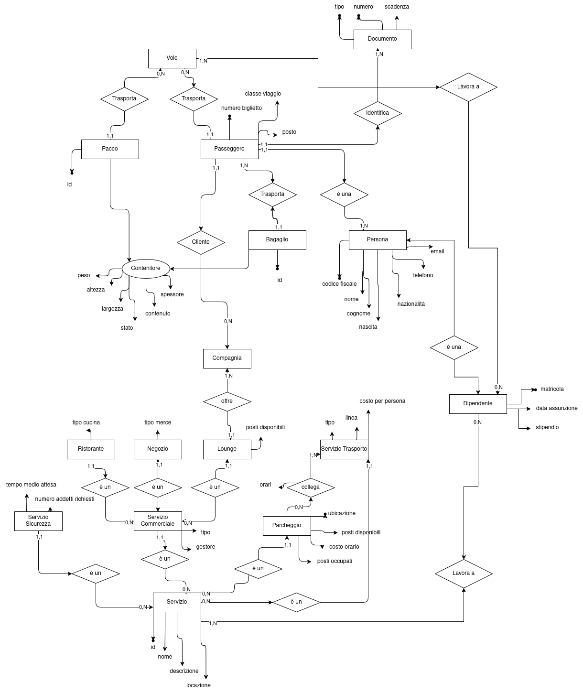

<h1 align="center"> Gestione aeroportuale </h1>
<p align="center"> 2024-12-27 </p>

<p align="center">
    Diego Barbieri <br>
    0001080333 <br>
    diego.barbieri5@studio.unibo.it <br>
</p>
<p align="center">
    Ivan De Simone <br>
    0001069314 <br>
    ivan.desimone@studio.unibo.it <br>
</p>

# Indice

- [Indice](#indice)
  - [Analisi dei requisiti](#analisi-dei-requisiti)
    - [Requisiti in linguaggio naturale](#requisiti-in-linguaggio-naturale)
    - [Glossario dei termini](#glossario-dei-termini)
    - [Eliminazione delle ambiguità](#eliminazione-delle-ambiguità)
    - [Strutturazione dei requisiti](#strutturazione-dei-requisiti)
    - [Specifica operazioni](#specifica-operazioni)
  - [Progettazione concettuale](#progettazione-concettuale)
    - [Identificazione delle entità e associazioni](#identificazione-delle-entità-e-associazioni)
    - [Scheletro dello schema ER (approccio top-down)](#scheletro-dello-schema-er-approccio-top-down)
    - [Sviluppo delle componenti (approccio inside-out)](#sviluppo-delle-componenti-approccio-inside-out)
    - [Unione delle componenti](#unione-delle-componenti)
    - [Dizionario dei dati](#dizionario-dei-dati)
    - [Regole aziendali](#regole-aziendali)
  - [Progettazione logica](#progettazione-logica)
    - [Tavole dei volumi e delle operazioni](#tavole-dei-volumi-e-delle-operazioni)
    - [Ristrutturazione schema concettuale](#ristrutturazione-schema-concettuale)
    - [Normalizzazione](#normalizzazione)
    - [Traduzione verso il modello logico](#traduzione-verso-il-modello-logico)
  - [Codifica SQL](#codifica-sql)
    - [DDL](#ddl)
    - [DML](#dml)
  - [Testing](#testing)
  - [Riferimenti](#riferimenti)

## Analisi dei requisiti

### Requisiti in linguaggio naturale

Si vuole realizzare una base di dati per la gestione di aeroporti italiani, con particolare attenzione alla gestione dei voli, dei passeggeri, dei lavoratori e dei servizi connessi. Nello specifico, si vuole memorizzare informazioni riguardanti aerei di tipologie cargo e passeggeri, i voli che essi effettuano, le merci e i passeggeri che viaggiano su di essi, i lavoratori che operano negli aeroporti e i servizi offerti da questi ultimi.

Per gli aeroporti sarà necessario mantenere il codice identificativo IATA e ICAO, il nome completo, la provincia e lo stato di appartenenza, il numero di posti aereo, separati in passeggeri e cargo. Oltre a ciò è fondamentale memorizzare i servizi offerti e i servizi di sicurezza. Riguardo gli aerei si vuole memorizzare la tipologia (passeggeri o cargo), il modello, l'identificativo, la compagnia aerea che lo possiede e la capienza.

Per quanto riguarda la gestione dei voli passeggeri, si vogliono memorizzare informazioni sui passeggeri tra le quali generalità (nome, cognome, data di nascita, nazionalità, un recapito telefonico e un indirizzo email), le compagnie aeree di cui sono clienti insieme al numero di km viaggiati con esse, i loro documenti di identità registrati ed i bagagli che trasportano. I bagagli si suddividono in bagagli a mano e bagagli da stiva. Di entrambi si vuole memorizzare il peso, le dimensioni (altezza, larghezza e spessore) e lo stato (disperso, danneggiato o integro). Dei bagagli da stiva si vuole inoltre mantenere una breve descrizione e un flag se è un animale. I voli devono essere memorizzati con il numero di volo, la data e l'ora di partenza e di arrivo, la compagnia aerea che lo opera, l'aereo utilizzato, l'aeroporto di partenza e di arrivo ed il personale a bordo.

Per quello che riguarda i voli cargo, si vogliono memorizzare numero di volo, data e ora di partenza e di arrivo contestualmente all'aeroporto, la compagnia logistica che lo opera, l'aereo utilizzato, il personale a bordo ed informazioni sul carico trasportato. Nello specifico, dei singoli pacchi si vuole memorizzare il peso, dimensioni (altezza, larghezza e spessore), contenuto e stato (medesimo del bagaglio).

La base di dati deve inoltre tenere traccia di tutti i dipendenti, distinguendo tra lavoratori degli aeroporti e lavoratori delle compagnie aeree/logistiche. I lavoratori presentano generalità uguali a quelle dei passeggeri, ma si vuole memorizzare anche dove lavorano, il ruolo che essi ricoprono e il loro stipendio.

Tra i servizi offerti dagli aeroporti si vuole memorizzare informazioni riguardanti le lounge, i parcheggi, i ristoranti e i negozi. Delle lounge si vuole mantenere la compagnia aerea che la mette a disposizione ed i posti disponibili. Dei parcheggi si vuole memorizzare l'ubicazione, il numero di posti disponibili, il costo orario ed il numero di posti occupati. Sarà inoltre necessario salvare tutti i servizi di trasporto che collegano l'aeroporto ai servizi esterni ad esso ed alle ulteriori infrastrutture urbanistiche. Dei ristoranti e dei negozi si vuole memorizzare il nome e il tipo di cucina o merce venduta. Gli esercizi commerciali possono essere gestiti da terzi, in tal caso si vuole memorizzare il nome del gestore. Per tutti i servizi è cruciale memorizzare i dipendenti.  I servizi di sicurezza devono essere memorizzati separatamente. Più precisamente, si vuole memorizzare il nome del servizio, il tempo medio di attesa e il numero di addetti richiesti per farlo operare.

### Glossario dei termini

| Termine | Descrizione | Sinonimi | Collegamenti | 
| --------------- | --------------- | --------------- | --------------- | 
| Aeroporto | stazione di transito di aerei | - | Volo, Lavoratore, Servizio |
| Volo | transito tra due aeroporti distinti | viaggio | Aeroporto, Aereo, Lavoratore |
| Volo passeggeri | volo che trasporta persone | - | Volo, Passeggero, Compagnia aerea |
| Passeggero | cliente per una compagnia aerea, presente su almeno un volo | cliente | Volo passeggeri, Identità |
| Bagaglio | oggetto trasportabile in una tratta aerea da una persona | valigia, borsa, zaino | Passeggero |
| Compagnia aerea | gestisce il trasporto passeggeri | - | Volo passeggeri, Aereo |
| Volo cargo | volo che trasporta merci | - | Volo, Pacco, Compagnia logistica |
| Pacco | contenitore per merci | - | Volo cargo |
| Compagnia logistica | si occupa della gestione degli aerei cargo e del trasporto merci | - | Volo cargo, Aereo |
| Aereo | mezzo di trasporto | aeromobile | Volo, Lavoratore (hostess, pilota), Aeroporto |
| Documento identità | documento che può essere di diversi tipi (carta d'identità, passaporto) | documento | Passeggero, Lavoratore |
| Lavoratore | personale assunto dell'aeroporto o a bordo di un volo | hostess, steward, impiegato, dipendente | Aeroporto, Volo, Servizio |
| Servizio di sicurezza | servizio di controllo delle attività ordinarie all'interno dell'aeroporto | controllo bagagli, controllo documenti | Aeroporto, Lavoratore |
| Servizio commerciale | attività interne all'aeroporto come ristorazione, negozi o lounge | negozio | Aeroporto, Lavoratore |
| Parcheggio | area di sosta per veicoli | - | Aeroporto, Servizio di trasporto |
| Servizio di trasporto | mezzo di collegamento a servizi esterni all'aeroporto | taxi, navetta | Aeroporto, Parcheggio |

### Eliminazione delle ambiguità

- **Voli**: si identifica con volo un singolo viaggio tra due aeroporti, con aereo l'aeromobile utilizzato per il viaggio, con compagnia la società che opera il volo, con personale a bordo i lavoratori che operano durante il volo. Voli passeggeri e voli cargo si differenziano esclusivamente per entità trasportata.
- **Aereo**: un aereo non può essere condiviso tra due compagnie.
- **Compagnia**: Non possono esistere due compagnie con lo stesso nome. Le compagnie aeree (per i passeggeri) e quelle logistiche (per le merci) sono equiparate in quanto le informazioni da mantenere sono le stesse per entrambe.
- **Passeggeri**: il passeggero è una persona nella base di dati, che ha comprato un biglietto per un volo, ha un documento di identità e può avere zero o più bagagli.
- **Parcheggi**: per ubicazione si intende longitudine e latitudine, per posti disponibili si intende il numero di posti totali, per posti occupati si intende il numero di posti attualmente occupati.
- **Servizi di trasporto**: i servizi di trasporto collegano l'aeroporto ad uno o più parcheggi. Per ogni parcheggio possono passare più servizi di trasporto ed un trasporto può passare per più parcheggi.

### Strutturazione dei requisiti

#### *Frasi di carattere generale*

Si vuole realizzare una base di dati per la gestione di aeroporti italiani, con particolare attenzione alla gestione dei voli, dei passeggeri, dei lavoratori e dei servizi connessi. Nello specifico, si vuole memorizzare informazioni riguardanti aerei di tipologie cargo e passeggeri, i voli che essi effettuano, le merci e i passeggeri che viaggiano su di essi, i lavoratori che operano negli aeroporti e i servizi offerti da questi ultimi.

#### *Frasi relative agli aeroporti*

Per gli aeroporti sarà necessario mantenere il codice identificativo IATA e ICAO, il nome completo, la provincia e lo stato di appartenenza, il numero di posti aereo, separati in passeggeri e cargo. Oltre a ciò è fondamentale memorizzare i servizi offerti e i servizi di sicurezza.

#### *Frasi relative agli aerei*

Riguardo gli aerei si vuole memorizzare la tipologia (passeggeri o cargo), il modello, l'identificativo, la compagnia aerea che lo possiede e la capienza.

#### *Frasi relative ai passeggeri*

Si vogliono memorizzare informazioni sui passeggeri tra le quali generalità (nome, cognome, data di nascita, nazionalità, un recapito telefonico e un indirizzo email), le compagnie aeree di cui sono clienti insieme al numero di km viaggiati con esse, i loro documenti di identità registrati ed i bagagli che trasportano.

#### *Frasi relative ai bagagli*

I bagagli si suddividono in bagagli a mano e bagagli da stiva. Di entrambi si vuole memorizzare il peso, le dimensioni (altezza, larghezza e spessore) e lo stato (disperso, danneggiato o integro). Dei bagagli da stiva si vuole inoltre mantenere una breve descrizione e un flag se è un animale.

#### *Frasi relative ai voli passeggeri*

I voli devono essere memorizzati con il numero di volo, la data e l'ora di partenza e di arrivo, la compagnia aerea che lo opera, l'aereo utilizzato, l'aeroporto di partenza e di arrivo ed il personale a bordo.

#### *Frasi relative ai voli cargo*

Per quello che riguarda i voli cargo, si vogliono memorizzare numero di volo, data e ora di partenza e di arrivo contestualmente all'aeroporto, la compagnia logistica che lo opera, l'aereo utilizzato, il personale a bordo ed informazioni sul carico trasportato.

#### *Frasi relative ai pacchi*

Nello specifico, dei singoli pacchi si vuole memorizzare il peso, dimensioni (altezza, larghezza e spessore), contenuto e stato (medesimo del bagaglio).

#### *Frasi relative ai lavoratori*

La base di dati deve inoltre tenere traccia di tutti i dipendenti, distinguendo tra lavoratori degli aeroporti e lavoratori delle compagnie aeree/logistiche. I lavoratori presentano generalità uguali a quelle dei passeggeri, ma si vuole memorizzare anche dove lavorano, il ruolo che essi ricoprono e il loro stipendio.

#### *Frasi relative ai servizi*

Tra i servizi offerti dagli aeroporti si vuole memorizzare informazioni riguardanti le lounge, i parcheggi, i ristoranti e i negozi. Per tutti i servizi è cruciale memorizzare i dipendenti.

Delle **lounge** si vuole mantenere la compagnia aerea che la mette a disposizione ed i posti disponibili. 

Dei **parcheggi** si vuole memorizzare l'ubicazione, il numero di posti disponibili, il costo orario ed il numero di posti occupati. 

Sarà inoltre necessario salvare tutti i **servizi di trasporto** che collegano l'aeroporto ai servizi esterni ad esso ed alle ulteriori infrastrutture urbanistiche.

Dei **ristoranti** e dei **negozi** si vuole memorizzare il nome e il tipo di cucina o merce venduta. Gli esercizi commerciali possono essere gestiti da terzi, in tal caso si vuole memorizzare il nome del gestore. 

I **servizi di sicurezza** devono essere memorizzati separatamente. Più precisamente, si vuole memorizzare il nome del servizio, il tempo medio di attesa e il numero di addetti richiesti per farlo operare.

### Specifica operazioni

#### *Inserimenti*

1. **Nuovo aeroporto**: 1 ogni 5 anni (stimato sulla base della crescita limitata in Italia).  
2. **Nuovo volo**: 750 aerei al giorno (stimando una media di 5 voli per aereo).  
3. **Nuovo passeggero**: 10.000 al giorno (media giornaliera per tutti gli aeroporti italiani).  
4. **Nuovo lavoratore**: 100 al mese (espansione e turnover).  
5. **Nuovo bagaglio**: 7 miliardi all'anno (stimando circa 2 bagagli per passeggero).  
6. **Nuovo pacco**: 65 milioni all'anno (stimando 40% pacchi di 5-10kg e restanti di 100kg).  
7. **Nuova compagnia**: 2 ogni anno (espansione del mercato).   

#### *Modifiche*

1. **Gestore servizio commerciale**: aggiornamenti mensili.  
2. **Servizio di sicurezza**: modifiche mensili.  
3. **Servizio di trasporto**: aggiornamenti trimestrali.  
4. **Volo**: ritardo, cancellazione, cambio aereo: 5.000 al giorno.  
5. **Documenti di identità**: aggiornamenti giornalieri.  
6. **Stato bagaglio**: 1.000 modifiche al giorno.  
7. **Stipendio lavoratore**: modifiche mensili.  
8. **Tempo di attesa controlli**: 72 modifiche al giorno.
9. **Posti nei parcheggi**: 24 modifiche al giorno.  

#### *Cancellazioni*

1. **Smantellamento aereo**: 5 all'anno.  
2. **Cancellazione volo**: 500 al giorno.  
3. **Invalidazione documenti di identità**: 50 al giorno.  
4. **Licenziamento lavoratore**: 20 al mese.  
5. **Chiusura servizio**: 10 al mese.  

#### *Ricerche*

1. **Voli in partenza**: 10.000 al giorno.  
2. **Voli in arrivo**: 10.000 al giorno.  
3. **Lavoratori aeroportuali**: 500 al giorno.  
4. **Lavoratori compagnie aeree**: 200 al giorno.  
5. **Lavoratori compagnie logistiche**: 50 al giorno.  
6. **Passeggeri**: 1.000.000 al giorno.  
7. **Bagagli**: 2.000.000 al giorno.  
8. **Merci trasportate**: 100.000 al giorno.  
9. **Servizi aeroportuali**: 300 al giorno.  
10. **Servizi di sicurezza**: 126 al giorno.  
11. **Servizi di trasporto**: 100 al giorno.  
12. **Stato parcheggi**: 140 al giorno.  

## Progettazione concettuale

### Identificazione delle entità e associazioni

Sono state identificate inizialmente le entità principali: aeroporto, aereo, volo, compagnia, persona, servizio. In un secondo momento sono state identificate ulteriori entità, quali passeggero e dipendente, specializzazioni di persona, e documento, bagaglio e pacco. Oltre a ciò sono stati suddivisi i servizi in sicurezza, trasporto, parcheggi e commerciali (lounge, ristoranti, negozi).  
Dall'entità volo sono state estratte due associazioni: trasportoPasseggeri verso i passeggeri e trasportoCargo verso i pacchi. Tra compagnia e passeggero è stata identificata un'associazione di clientela. A partire da dipendente sono state trovate due associazioni verso le due possibilità di lavoro, ovvero volo e servizio.

### Scheletro dello schema ER (approccio top-down)


### Sviluppo delle componenti (approccio inside-out)

Volo e connessi.


Voli passeggeri e voli cargo.


Servizi aeroportuali e servizi di sicurezza.


### Unione delle componenti



### Dizionario dei dati

**Entità**

| Nome Entità | Descrizione | Attributi | Identificatore |
| --------------- | --------------- | --------------- | --------------- |
| AEROPORTO | Stazione di transito di aerei | IATA, ICAO, nome, provincia, stato, postiAereoPasseggeri, postiAereoCargo | IATA, ICAO |
| AEREO | Mezzo di trasporto | tipologia, modello, numeroDiSerie, postiPasseggeri, postiPersonale, volumeStiva | numeroDiSerie |
| VOLO | Transito tra due aeroporti distinti | numeroVolo, partenza, arrivo | numeroVolo |
| COMPAGNIA | Organizza i voli e possiede gli aerei | nome, sede | nome |
| PACCO | Contenitore per merci | id, peso, altezza, larghezza, spessore, contenuto, stato | id |
| PERSONA | Individuo | codiceFiscale, nome, cognome, dataNascita, nazionalita, numeroTelefono, email | codiceFiscale |
| PASSEGGERO | Cliente per una compagnia aerea, presente su almeno un volo | classeViaggio, numeroBiglietto, posto | numeroBiglietto |
| BAGAGLIO | Oggetto trasportabile in una tratta aerea da una persona | id, peso, altezza, larghezza, spessore, stato, descrizione, animale | id |
| DIPENDENTE | Personale dell'aeroporto o di volo | matricola, dataAssunzione, stipendio | matricola |
| DOCUMENTO | Documento di identità | tipo, numero, scadenza | numero, tipo |
| SERVIZIO | Servizio aeroportuale | id, nome, descrizione, locazione | id |
| SERVIZIOSICUREZZA | Servizio di controllo delle attività ordinarie all'interno dell'aeroporto | tempoMedioAttesa, numeroAddettiRichiesti | " |
| SERVIZIOTRASPORTO | Mezzo di collegamento a servizi esterni all'aeroporto | tipo, linea, costoPerPersona | " |
| SERVIZIOCOMMERCIALE | Attività interne all'aeroporto come ristorazione, negozi o lounge | tipo, gestore | " |
| PARCHEGGIO | Area di sosta per veicoli | latitudine, longitudine, postiDisponibili, costoOrario, postiOccupati | latitudine, longitudine |
| RISTORANTE | Attività commerciale di ristorazione | tipoCucina | " |
| NEGOZIO | Attività commerciale di vendita | tipoMerce | " |
| LOUNGE | Area di relax | postiDisponibili | " |

**Associazioni**

| Nome Associazione | Descrizione | Entità coinvolte | Attributi |
| --------------- | --------------- | --------------- | --------------- |
| FORNISCE | Associa gli aeroporti ai servizi | AEROPORTO(1,N) - SERVIZIO(1,1) | - |
| PARTENZA | Associa i voli a un aeroporto di partenza | VOLO(1,1) - AEROPORTO(1,N) | - |
| ARRIVO | Associa i voli a un aeroporto di arrivo | VOLO(1,1) - AEROPORTO(1,N) | - |
| USO_AEREO | Associa i voli a un aereo | VOLO(1,1) - AEREO(1,N) | - |
| TRASPORTO_PASSEGGERI | Associa i passeggeri ai voli | VOLO(0,N) - PASSEGGERO(1,1) | - |
| TRASPORTO_CARGO | Associa i pacchi ai voli | VOLO(0,N) - PACCO(1,1) | carico (string) |
| OPERA | Associa una compagnia ai voli | COMPAGNIA(1,N) - VOLO(1,1) | - |
| POSSESSO | Associa una compagnia agli aerei | COMPAGNIA(1,N) - AEREO(1,1) | - |
| TRASPORTO_BAGAGLIO | Associa i bagagli a un passeggero | BAGAGLIO(1,1) - PASSEGGERO(0,N) | - |
| CLIENTELA | Associa i passeggeri alle compagnie | PASSEGGERO(1,N) - COMPAGNIA(1,N) | kmViaggiati (int) |
| IDENTIFICAZIONE | Associa i documenti di identità a una persona | DOCUMENTO(1,1) - PERSONA(1,N) | - |
| LAVORO_VOLO | Associa i dipendenti ai voli | DIPENDENTE(0,N) - VOLO(1,N) | oraInizio (time), oraFine (time), mansione(string) |
| LAVORO_SERVIZIO | Associa i dipendenti ai servizi | DIPENDENTE(0,N) - SERVIZIO(1,N) | oraInizio (time), oraFine (time), mansione (string) |
| OFFRE | Associa una compagnia a una lounge | COMPAGNIA(1,1) - LOUNGE(1,1) | - |
| COLLEGA | Associa i servizi di trasporto ai parcheggi | SERVIZIOTRASPORTO(1,N) - PARCHEGGIO(1,N) | orari (string) |

### Regole aziendali

1. Il volume della stiva di un aereo deve essere espresso in metri cubi.
2. Lo stato per i bagagli e i pacchi è "integro" a prescindere inizialmente. A seguito del volo il valore può essere eventualmente aggiornato in "danneggiato" o "disperso".
3. Lo stipendio di un dipendente è inteso come mensile e deve essere > 0.
4. Il tempo medio di attesa ad un servizio di sicurezza deve essere aggiornato ogni 20 minuti.
5. Il numero di posti occupati in un parcheggio deve essere aggiornato ogni 60 minuti.

## Progettazione logica

### Tavole dei volumi e delle operazioni

#### *Tavola dei volumi*

| Concetto | Tipo | Volume |
| --------------- | --------------- | --------------- |
| Aeroporto(Italia) | E | 126 |
| Aereo | E | 1.000 |
| Volo | E | 10.000 |
| Compagnia | E | 120 |
| Persona | E | 3.700.000 |
| Bagaglio | E | 6.000.000 |
| Servizio | E | 10.000 |
| ServizioSicurezza | E | 126 |
| Parcheggio | E | 140 |
| ServizioTrasporto | E | 100 |
| ServizioCommerciale | E | 200 |
| Ristorante | E | 5.000 |
| Negozi | E | 4.000 |
| Lounge | E | 90 |
| Dipendente | E | 30.000 |
| Documento | E | 20.100 |
| Passeggero | E | 1.000.000 |
| Pacco | E | 65.000.000 |

#### *Tavola delle operazioni*

| Operazione                              | Tipo         | Frequenza stimata                           |
|-----------------------------------------|--------------|---------------------------------------------|
| **Inserimenti**                         |              |                                             |
| Nuovo aeroporto                         | Inserimento  | 1 ogni 5 anni                               |
| Nuovo volo                              | Inserimento  | 750 al giorno (circa 273.750 all'anno)      |
| Nuovo passeggero                        | Inserimento  | 10.000 al giorno (circa 3.650.000 all'anno) |
| Nuovo lavoratore                        | Inserimento  | 100 al mese (circa 1.200 all'anno)          |
| Nuovo bagaglio                          | Inserimento  | 7 miliardi all'anno                         |
| Nuovo pacco                             | Inserimento  | 65 milioni all'anno                         |
| Nuova compagnia                         | Inserimento  | 2 all'anno                                  |
| **Modifiche**                           |              |                                             |
| Gestore servizio commerciale            | Modifica     | Variabile, stimata 50 al mese               |
| Servizio di sicurezza                   | Modifica     | 50 al mese                                  |
| Servizio di trasporto                   | Modifica     | 30 al mese                                  |
| Volo (ritardo, cancellazione, cambio)   | Modifica     | 5% dei voli giornalieri (~37 al giorno)     |
| Documenti di identità                   | Modifica     | 1.000 al mese                               |
| Stato bagaglio                          | Modifica     | 1% dei bagagli (circa 70 milioni all'anno)  |
| Stipendio lavoratore                    | Modifica     | 10.000 all'anno                             |
| Tempo di attesa controlli               | Modifica     | 72 al giorno                                |
| Posti nei parcheggi                     | Modifica     | 24 al giorno                                |
| **Cancellazioni**                       |              |                                             |
| Smantellamento aereo                    | Cancellazione| 1 ogni 5 anni                               |
| Cancellazione volo                      | Cancellazione| 1% dei voli (circa 100 al giorno)           |
| Invalidazione documenti di identità     | Cancellazione| 100 al mese                                 |
| Licenziamento lavoratore                | Cancellazione| 50 al mese                                  |
| Chiusura servizio                       | Cancellazione| 10 al mese                                  |
| **Ricerche**                            |              |                                             |
| Voli in partenza                        | Ricerca      | 1.000 al giorno                             |
| Voli in arrivo                          | Ricerca      | 1.000 al giorno                             |
| Lavoratori aeroportuali                 | Ricerca      | 500 al giorno                               |
| Lavoratori compagnie aeree              | Ricerca      | 200 al giorno                               |
| Lavoratori compagnie logistiche         | Ricerca      | 100 al giorno                               |
| Passeggeri                              | Ricerca      | 10.000 al giorno                            |
| Bagagli                                 | Ricerca      | 1% dei bagagli giornalieri (~700.000)       |
| Merci trasportate                       | Ricerca      | 1.000 al giorno                             |
| Servizi aeroportuali                    | Ricerca      | 100 al giorno                               |
| Servizi di sicurezza                    | Ricerca      | 50 al giorno                                |
| Servizi di trasporto                    | Ricerca      | 30 al giorno                                |
| Stato parcheggi                         | Ricerca      | 200 al giorno                               |

### Ristrutturazione schema concettuale

#### *Ridondanze e normalizzazione* 

Il database presenta le seguenti ridondanze:
- Compagnia: il numero di km viaggiati da un passeggero con una compagnia aerea è ridondante, in quanto può essere calcolato a partire dai voli effettuati dal passeggero con quella compagnia.

Al fine di migliorare le prestazioni del database verranno quindi introdotte le seguenti modifiche:
- Passeggeri: dato l'elevato numero di inserimenti e ricerche. Verrà introdotta all'interno della tabella passeggero le informazioni relative alla persona, in modo da evitare di dover fare join tra le due tabelle.
- Passeggeri: introduzione di un attributo numeroPasseggeri all'interno della tabella volo, in modo velocizzare il calcolo del numero di passeggeri presenti su un volo.

**Tavola accessi in presenza di ridondanze** 

Inserimento di un passeggero:
| Tabella | Operazione | Accessi |
| --------------- | --------------- | --------------- |
| PERSONA | S | 1 |
| PASSEGGERO | S | 1 |

Ricerca di un passeggero:
| Tabella | Operazione | Accessi |
| --------------- | --------------- | --------------- |
| PERSONA | L | 1 |

**Tavola accessi in assenza di ridondanze** 

Inserimento di un passeggero:
| Tabella | Operazione | Accessi |
| --------------- | --------------- | --------------- |
| PASSEGGERO | S | 1 |
| PERSONA | S | 1 |

Ricerca di un passeggero:
| Tabella | Operazione | Accessi |
| --------------- | --------------- | --------------- |
| PASSEGGERO | L | 1 |
| PERSONA | L | 1 |

Contando che circa 10.000 passeggeri vengono visualizzati al giorno, calcoliamo le differenze di prestazioni:  
Consideriamo le enormi dimensioni della tabella "PERSONA" e teniamo conto del fatto che la ridondanza dimezzerebbe i tempi in lettura. Tuttavia, la ridondanza comporterebbe un aumento dei tempi in scrittura, in quanto ogni modifica a un passeggero comporterebbe una modifica anche alla tabella "PERSONA". Inoltre, la ridondanza comporterebbe un aumento dello spazio occupato in memoria. Pertanto, la scelta migliore è quella di mantenere la struttura normalizzata.

Proviamo invece a calcolare il numero di passeggeri che appartengono ad un volo:

**Tabella con ridondanze** 
Inserimento di un passeggero:
| Tabella | Operazione | Accessi |
| --------------- | --------------- | --------------- |
| PASSEGGERO | S | 1 |
| PERSONA | S | 1 |
| VOLO | S | 1 |

Costo di un inserimento: 3

Ricerca di un volo:
| Tabella | Operazione | Accessi |
| --------------- | --------------- | --------------- |
| VOLO | L | 1 |

Costo di una ricerca: 1

Tempo totale di inserimento: 3 * 10.000 (volte al mese) = 30.000
Tempo totale di ricerca: 1 * 10.000 (volte al mese) = 10.000

**Tabella senza ridondanze**
Inserimento di un passeggero:
| Tabella | Operazione | Accessi |
| --------------- | --------------- | --------------- |
| PASSEGGERO | S | 1 |
| PERSONA | S | 1 |

Costo di un inserimento: 2

Ricerca di un volo:
| Tabella | Operazione | Accessi |
| --------------- | --------------- | --------------- |
| VOLO | L | 1 |
| PASSEGGERO | L | N |

Costo di una ricerca: 1 + N

Tempo totale di inserimento: 2 * 10.000 (volte al mese) = 20.000
Tempo totale di ricerca: 1 * 10.000 (volte al mese) + N * 10.000 (volte al mese) = 10.000 + N * 10.000

Dato un elevatissimo numero di passeggeri, e una necessità di ricerca di voli molto alta giorno per giorno, la scelta di mantenere la ridondanza ridurrebbe il tempo in lettura, migliorando le prestazioni del database.

Non essendo presente alcun tipo di ricerca Passeggeri associati a compagnia, la ridondanza non comporterebbe alcun beneficio in termini di prestazioni. Pertanto, la scelta migliore è quella di rimuoverla.

#### *Gestione delle gerarchie*

Nel sistema sono presenti le seguenti gerarchie:
- Persona: dipendente, passeggero
- Servizio: servizio commerciale, servizio di sicurezza, servizio di trasporto

L'entità persona è stata suddivisa in due sotto-entità: dipendente e passeggero, entrambe con riferimento all'entità padre. Questa scelta è stata fatta per differenziare i due tipi di persone presenti nel sistema, in modo da poter memorizzare informazioni specifiche per ciascuna di esse.

Anche l'entità servizio astrae tre sotto-entità: servizio commerciale, servizio di sicurezza e servizio di trasporto. Anche in questo caso si è deciso di differenziare le relazioni mantenendo un riferimento all'entità padre.

### Normalizzazione

**Associazioni**: le associazioni si presentano in forma normale di Boyce-Codd.

**Entità** 

| Nome | Commento |
| --------------- | --------------- |
| AEROPORTO | Non esistono dipendenze non banali tra gli attributi. |
| AEREO | Non esistono dipendenze funzionali non banali tra gli attributi. |
| VOLO | Non esistono dipendenze non banali tra gli attributi. |
| COMPAGNIA | Non esistono dipendenze non banali tra gli attributi. |
| PACCO | Peso dipende da contenuto, contenuto dipende da stato (?) |
| PERSONA | Non esistono dipendenze non banali tra gli attributi. |
| PASSEGGERO | Non esistono dipendenze non banali tra gli attributi. |
| BAGAGLIO | Peso dipende da descrizione o se si tratta di un animale. |
| DIPENDENTE | Non esistono dipendenze non banali tra gli attributi. |
| DOCUMENTO | Non esistono dipendenze non banali tra gli attributi. |
| SERVIZIO | Non esistono dipendenze non banali tra gli attributi. |
| SERVIZIO_SICUREZZA | Non esistono dipendenze non banali tra gli attributi. |
| SERVIZIO_COMMERCIALE | Non esistono dipendenze non banali tra gli attributi. |
| PARCHEGGIO | ubicazione non è un attrivuto |
| RISTORANTE | Non esistono dipendenze non banali tra gli attributi. |  
| NEGOZIO | Non esistono dipendenze non banali tra gli attributi. |
| LOUNGE | Non esistono dipendenze non banali tra gli attributi. |
| SERVIZIO_TRASPORTO | Orari non e' un attributo atomico. |

Modifiche alla struttura:


### Traduzione verso il modello logico

| Traduzione | Vincoli di riferimento | 
| --------------- | --------------- |
| AEROPORTO | <ins>IATA, ICAO</ins>, nome, provincia, stato, postiAereoPasseggeri, postiAereoCargo | 
| AEREO | <ins> numeroDiSerie</ins>, tipologia, modello, postiPasseggeri, postiPersonale, volumeStiva, *nomeCompagnia* |
| VOLO | <ins>numeroVolo</ins>, partenza, arrivo, *IATAArrivo, ICAOArrivo, IATAPartenza, ICAOPartenza, nomeCompagnia, aereo* |
| COMPAGNIA | <ins>nome</ins>, sede |
| PACCO | <ins>id</ins>, peso, altezza, larghezza, spessore, contenuto, stato, *numeroVolo* |
| PERSONA | <ins>codiceFiscale</ins>, nome, cognome, dataNascita, nazionalita, numeroTelefono, email |
| PASSEGGERO | <ins>numeroBiglietto</ins>, classeViaggio, posto, *codiceFiscale*, *numeroVolo* |
| BAGAGLIO | <ins>id</ins>, peso, altezza, larghezza, spessore, stato, descrizione, animale, *numeroBiglietto* |
| DIPENDENTE | <ins>matricola</ins>, dataAssunzione, stipendio, *codiceFiscale* |
| DOCUMENTO | <ins>tipo, numero</ins>, scadenza, *codiceFiscale* |
| SERVIZIO | <ins>id</ins>, nome, descrizione, locazione, *IATA, ICAO* |
| SERVIZIO_SICUREZZA | tempoMedioAttesa, numeroAddettiRichiesti, <ins>*id*<ins> |
| SERVIZIO_COMMERCIALE | tipo, gestore, <ins>*id*<ins> |
| PARCHEGGIO | <ins>longitudine, latitudine</ins>, postiDisponibili, costoOrario, postiOccupati, <ins>*id*</ins>  |
| RISTORANTE | tipoCucina, <ins>*id*</ins> |
| NEGOZIO | tipoMerce, <ins>*id*</ins> |
| LOUNGE | postiDisponibili, <ins>*id*</ins>, *nomeCompagnia*|
| SERVIZIO_TRASPORTO | tipo, linea, costoPerPersona, <ins>*id*</ins> |
| TRASPORTO_PARCHEGGIO | frequenza, intervallo, <ins>*id, longitudine, latitudine*</ins> |
| LAVORO_SERVIZIO | oraInizio, oraFine, mansione, <ins>*matricola, id*</ins> |
| LAVORO_VOLO | oraInizio, oraFine, mansione, <ins>*matricola, numeroVolo*</ins> |

| Traduzione | Vincoli di riferimento |
| --------------- | --------------- |
| AEROPORTO | - |
| AEREO | nomeCompagnia -> COMPAGNIA.nome |
| VOLO | IATAArrivo, IATAPartenza, ICAOArrivo, ICAOPartenza, nomeCompagnia, aereo -> AEROPORTO.IATA, AEROPORTO.ICAO, COMPAGNIA.nome, AEREO.numeroDiSerie |
| COMPAGNIA | - |
| PACCO | numeroVolo -> VOLO.numeroVolo |
| PERSONA | - |
| PASSEGGERO | numeroVolo, codiceFiscale -> VOLO.numeroVolo, PERSONA.codiceFiscale |
| BAGAGLIO | numeroBiglietto -> PASSEGGERO.numeroBiglietto |
| DIPENDENTE | codiceFiscale -> PERSONA.codiceFiscale |
| DOCUMENTO | codiceFiscale -> PERSONA.codiceFiscale |
| SERVIZIO | IATA, ICAO -> AEROPORTO.IATA, AEROPORTO.ICAO |
| SERVIZIO_SICUREZZA | id -> SERVIZIO.id |
| SERVIZIO_COMMERCIALE | id -> SERVIZIO.id |
| PARCHEGGIO | id -> SERVIZIO.id |
| RISTORANTE | id -> SERVIZIO.id |
| NEGOZIO | id -> SERVIZIO.id |
| LOUNGE | id, nomeCompagnia -> SERVIZIO.id, COMPAGNIA.nome |
| SERVIZIO_TRASPORTO | id -> SERVIZIO.id |
| TRASPORTO_PARCHEGGIO | id, longitudine, latitudine -> SERVIZIO_TRASPORTO.id, PARCHEGGIO.longitudine, PARCHEGGIO.latitudine |
| LAVORO_SERVIZIO | matricola, id -> DIPENDENTE.matricola, SERVIZIO.id |
| LAVORO_VOLO | matricola, numeroVolo -> DIPENDENTE.matricola, VOLO.numeroVolo |

## Codifica SQL

### DDL

#### *Creazione database e tabelle*

TODO: controllare gli on delete cascade per le eliminazioni

```sql
-- Create the database
CREATE DATABASE aereodb;

-- No deps

CREATE TABLE aeroporto (
    IATA CHAR(3) NOT NULL,
    ICAO CHAR(4) NOT NULL,
    nome VARCHAR(50) NOT NULL,
    provincia VARCHAR(50) NOT NULL,
    stato VARCHAR(50) NOT NULL,
    postiAereoPasseggeri INT NOT NULL,
    postiAereoCargo INT NOT NULL,
    PRIMARY KEY (IATA, ICAO)
);

CREATE TABLE compagnia (
    nome VARCHAR(50) NOT NULL,
    sede VARCHAR(50) NOT NULL,
    PRIMARY KEY (nome)
);

CREATE TABLE persona (
    codiceFiscale CHAR(16) NOT NULL,
    nome VARCHAR(50) NOT NULL,
    cognome VARCHAR(50) NOT NULL,
    dataNascita DATE NOT NULL,
    nazionalita VARCHAR(50) NOT NULL,
    numeroTelefono CHAR(10) NOT NULL,
    email VARCHAR(50) NOT NULL,
    PRIMARY KEY (codiceFiscale)
);

-- With deps

CREATE TABLE aereo (
    numeroDiSerie CHAR(10) NOT NULL,
    tipologia VARCHAR(50) NOT NULL,
    modello VARCHAR(50) NOT NULL,
    postiPasseggeri INT NOT NULL,
    postiPersonale INT NOT NULL,
    volumeStiva INT NOT NULL,
    nomeCompagnia VARCHAR(50),
    PRIMARY KEY (numeroDiSerie),
    FOREIGN KEY (nomeCompagnia) REFERENCES compagnia(nome) ON DELETE SET NULL
);

CREATE TABLE volo (
    numeroVolo CHAR(6) NOT NULL,
    partenza DATETIME NOT NULL,
    arrivo DATETIME NOT NULL,
    IATAArrivo CHAR(3) NOT NULL,
    ICAOArrivo CHAR(4) NOT NULL,
    IATAPartenza CHAR(3) NOT NULL,
    ICAOPartenza CHAR(4) NOT NULL,
    nomeCompagnia VARCHAR(50) NOT NULL,
    aereo CHAR(10) NOT NULL,
    numeroPasseggeri INT DEFAULT 0,
    PRIMARY KEY (numeroVolo),
    FOREIGN KEY (IATAArrivo, ICAOArrivo) REFERENCES aeroporto(IATA, ICAO),
    FOREIGN KEY (IATAPartenza, ICAOPartenza) REFERENCES aeroporto(IATA, ICAO),
    FOREIGN KEY (nomeCompagnia) REFERENCES compagnia(nome) ON DELETE CASCADE,
    FOREIGN KEY (aereo) REFERENCES aereo(numeroDiSerie)
);

CREATE TABLE pacco (
    id INT NOT NULL AUTO_INCREMENT,
    peso DECIMAL(5, 2) NOT NULL,
    altezza INT NOT NULL,
    larghezza INT NOT NULL,
    spessore INT NOT NULL,
    contenuto VARCHAR(50) NOT NULL,
    stato ENUM('integro', 'danneggiato', 'disperso') DEFAULT 'integro',
    numeroVolo CHAR(6) NOT NULL,
    PRIMARY KEY (id),
    FOREIGN KEY (numeroVolo) REFERENCES volo(numeroVolo) ON DELETE CASCADE
);

CREATE TABLE passeggero (
    numeroBiglietto CHAR(6) NOT NULL,
    classeViaggio VARCHAR(50) NOT NULL,
    posto VARCHAR(50) NOT NULL,
    codiceFiscale CHAR(16) NOT NULL,
    numeroVolo CHAR(6) NOT NULL,
    PRIMARY KEY (numeroBiglietto),
    FOREIGN KEY (codiceFiscale) REFERENCES persona(codiceFiscale) ON DELETE CASCADE,
    FOREIGN KEY (numeroVolo) REFERENCES volo(numeroVolo) ON DELETE CASCADE
);

CREATE TABLE bagaglio (
    id INT NOT NULL AUTO_INCREMENT,
    peso DECIMAL(5,2) NOT NULL,
    altezza INT NOT NULL,
    larghezza INT NOT NULL,
    spessore INT NOT NULL,
    stato ENUM('integro', 'danneggiato', 'disperso') DEFAULT 'integro',
    descrizione VARCHAR(50) NOT NULL,
    animale BOOLEAN NOT NULL,
    numeroBiglietto CHAR(6) NOT NULL,
    PRIMARY KEY (id),
    FOREIGN KEY (numeroBiglietto) REFERENCES passeggero(numeroBiglietto)
);

CREATE TABLE dipendente (
    matricola CHAR(6) NOT NULL,
    dataAssunzione DATE NOT NULL,
    stipendio INT NOT NULL,
    codiceFiscale CHAR(16) NOT NULL,
    PRIMARY KEY (matricola),
    FOREIGN KEY (codiceFiscale) REFERENCES persona(codiceFiscale) ON DELETE CASCADE,
    CHECK (stipendio > 0)
);

CREATE TABLE documento (
    tipo VARCHAR(50) NOT NULL,
    numero VARCHAR(50) NOT NULL,
    scadenza DATE NOT NULL,
    codiceFiscale CHAR(16) NOT NULL,
    PRIMARY KEY (tipo, numero),
    FOREIGN KEY (codiceFiscale) REFERENCES persona(codiceFiscale) ON DELETE CASCADE
);

CREATE TABLE servizio (
    id INT NOT NULL AUTO_INCREMENT,
    nome VARCHAR(50) NOT NULL,
    descrizione VARCHAR(50) NOT NULL,
    locazione VARCHAR(50) NOT NULL,
    IATA CHAR(3) NOT NULL,
    ICAO CHAR(4) NOT NULL,
    PRIMARY KEY (id),
    FOREIGN KEY (IATA, ICAO) REFERENCES aeroporto(IATA, ICAO)
);

CREATE TABLE servizio_sicurezza (
    tempoMedioAttesa INT,
    numeroAddettiRichiesti INT CHECK (numeroAddettiRichiesti > 0),
    id INT NOT NULL,
    PRIMARY KEY (id),
    FOREIGN KEY (id) REFERENCES servizio(id) ON DELETE CASCADE
);

CREATE TABLE servizio_commerciale (
    tipo VARCHAR(50) NOT NULL,
    gestore VARCHAR(50) NOT NULL,
    id INT NOT NULL,
    PRIMARY KEY (id),
    FOREIGN KEY (id) REFERENCES servizio(id) ON DELETE CASCADE
);

CREATE TABLE parcheggio (
    longitudine DECIMAL(10, 8) NOT NULL,
    latitudine DECIMAL(10, 8) NOT NULL,
    postiDisponibili INT NOT NULL,
    costoOrario DECIMAL(5, 2) NOT NULL,
    postiOccupati INT NOT NULL,
    id INT NOT NULL,
    PRIMARY KEY (longitudine, latitudine),
    FOREIGN KEY (id) REFERENCES servizio(id) ON DELETE CASCADE
);

CREATE TABLE ristorante (
    tipoCucina VARCHAR(50) NOT NULL,
    id INT NOT NULL,
    PRIMARY KEY (id),
    FOREIGN KEY (id) REFERENCES servizio(id) ON DELETE CASCADE
);

CREATE TABLE negozio (
    tipoMerce VARCHAR(50) NOT NULL,
    id INT NOT NULL,
    PRIMARY KEY (id),
    FOREIGN KEY (id) REFERENCES servizio(id) ON DELETE CASCADE
);

CREATE TABLE lounge (
    postiDisponibili INT NOT NULL,
    id INT NOT NULL,
    nomeCompagnia VARCHAR(50) NOT NULL,
    PRIMARY KEY (id),
    FOREIGN KEY (id) REFERENCES servizio(id) ON DELETE CASCADE,
    FOREIGN KEY (nomeCompagnia) REFERENCES compagnia(nome)
);

CREATE TABLE servizio_trasporto (
    tipo ENUM('navetta', 'bus', 'treno', 'tram', 'taxi') NOT NULL,
    linea VARCHAR(50) NOT NULL,
    costoPerPersona DECIMAL(5, 2) NOT NULL,
    id INT NOT NULL,
    PRIMARY KEY (id),
    FOREIGN KEY (id) REFERENCES servizio(id) ON DELETE CASCADE
);

CREATE TABLE trasporto_parcheggio (
    id INT NOT NULL,
    longitudine DECIMAL(10, 8) NOT NULL,
    latitudine DECIMAL(10, 8) NOT NULL,
    frequenza ENUM('minutaria', 'oraria', 'giornaliera') NOT NULL,
    intervallo INT NOT NULL,
    PRIMARY KEY (id, longitudine, latitudine),
    FOREIGN KEY (id) REFERENCES servizio_trasporto(id) ON DELETE CASCADE,
    FOREIGN KEY (longitudine, latitudine) REFERENCES parcheggio(longitudine, latitudine) ON DELETE CASCADE
);

CREATE TABLE lavoro_servizio (
    matricola CHAR(6) NOT NULL,
    id INT NOT NULL,
    mansione VARCHAR(50) NOT NULL,
    oraInizio DATETIME NOT NULL,
    oraFine DATETIME NOT NULL,
    PRIMARY KEY (matricola, id),
    FOREIGN KEY (matricola) REFERENCES dipendente(matricola),
    FOREIGN KEY (id) REFERENCES servizio(id),
    CHECK (oraInizio <= oraFine)
);

CREATE TABLE lavoro_volo(
    matricola CHAR(6) NOT NULL,
    numeroVolo CHAR(6) NOT NULL,
    mansione VARCHAR(50) NOT NULL,
    oraInizio DATETIME NOT NULL,
    oraFine DATETIME NOT NULL,
    PRIMARY KEY (matricola, numeroVolo),
    FOREIGN KEY (matricola) REFERENCES dipendente(matricola),
    FOREIGN KEY (numeroVolo) REFERENCES volo(numeroVolo) ON DELETE CASCADE,
    CHECK (oraInizio <= oraFine)
);
```

#### *Popolamento tabelle*

```sql
-- Popola la tabella aeroporto
INSERT INTO aeroporto (IATA, ICAO, nome, provincia, stato, postiAereoPasseggeri, postiAereoCargo)
VALUES 
  ('FCO', 'LIRF', 'Leonardo da Vinci', 'Roma', 'Italia', 1000, 200),
  ('MXP', 'LIMC', 'Malpensa', 'Milano', 'Italia', 800, 150),
  ('VCE', 'LIPZ', 'Marco Polo', 'Venezia', 'Italia', 500, 100);

-- Popola la tabella compagnia
INSERT INTO compagnia (nome, sede)
VALUES 
  ('Alitalia', 'Roma'),
  ('Ryanair', 'Dublino'),
  ('EasyJet', 'Londra');

-- Popola la tabella persona
INSERT INTO persona (codiceFiscale, nome, cognome, dataNascita, nazionalita, numeroTelefono, email)
VALUES 
  ('RSSMRA85M01H501T', 'Mario', 'Rossi', '1985-01-01', 'Italiana', '3312345678', 'mario.rossi@example.com'),
  ('VRDLGI90F10H501V', 'Luigi', 'Verdi', '1990-06-10', 'Italiana', '3398765432', 'luigi.verdi@example.com'),
  ('BNCLRA75T20H501X', 'Clara', 'Bianchi', '1975-12-20', 'Italiana', '3481122334', 'clara.bianchi@example.com'),
  ('SMTTNS80L15H501Y', 'Antonio', 'Smith', '1980-07-15', 'Statunitense', '3475566778', 'antonio.smith@example.com'),
  ('HLCKRN88K01H501Z', 'Karen', 'Holmes', '1988-11-01', 'Britannica', '3453344556', 'karen.holmes@example.com'),
  ('DVLJHN92A20H501W', 'John', 'Doe', '1992-01-20', 'Canadese', '3492233445', 'john.doe@example.com');

-- Popola la tabella aereo
INSERT INTO aereo (numeroDiSerie, tipologia, modello, postiPasseggeri, postiPersonale, volumeStiva, nomeCompagnia)
VALUES 
  ('A12345', 'Passeggeri', 'Boeing 737', 150, 5, 200, 'Alitalia'),
  ('B67890', 'Cargo', 'Airbus A300', 0, 3, 500, 'Ryanair'),
  ('C11223', 'Passeggeri', 'Embraer 190', 100, 4, 150, 'EasyJet');

-- Popola la tabella volo
INSERT INTO volo (numeroVolo, partenza, arrivo, IATAArrivo, ICAOArrivo, IATAPartenza, ICAOPartenza, nomeCompagnia, aereo)
VALUES 
  ('AZ1234', '2025-01-15 10:00:00', '2025-01-15 12:00:00', 'MXP', 'LIMC', 'FCO', 'LIRF', 'Alitalia', 'A12345'),
  ('RY5678', '2025-01-16 14:00:00', '2025-01-16 16:30:00', 'VCE', 'LIPZ', 'FCO', 'LIRF', 'Ryanair', 'B67890'),
  ('EZ9101', '2025-01-17 08:00:00', '2025-01-17 10:30:00', 'FCO', 'LIRF', 'MXP', 'LIMC', 'EasyJet', 'C11223');

-- Popola la tabella pacco
INSERT INTO pacco (peso, altezza, larghezza, spessore, contenuto, stato, numeroVolo)
VALUES 
  (10.50, 40, 30, 20, 'Elettronica', 'integro', 'RY5678'),
  (25.00, 60, 50, 40, 'Vestiti', 'danneggiato', 'RY5678'),
  (5.20, 20, 15, 10, 'Documenti', 'integro', 'RY5678');

-- Popola la tabella passeggero
INSERT INTO passeggero (numeroBiglietto, classeViaggio, posto, codiceFiscale, numeroVolo)
VALUES 
  ('B12345', 'Economy', '12A', 'RSSMRA85M01H501T', 'AZ1234'),
  ('B67890', 'Business', '1C', 'VRDLGI90F10H501V', 'AZ1234'),
  ('B11223', 'First', '1A', 'BNCLRA75T20H501X', 'EZ9101');

-- Popola la tabella bagaglio
INSERT INTO bagaglio (peso, altezza, larghezza, spessore, stato, descrizione, animale, numeroBiglietto)
VALUES 
  (23.5, 80, 50, 30, 'integro', 'Valigia grande', FALSE, 'B12345'),
  (15.2, 60, 40, 20, 'danneggiato', 'Zaino', FALSE, 'B67890'),
  (12.0, 50, 30, 30, 'integro', 'Porta cane', TRUE, 'B67890'),
  (7.8, 40, 30, 20, 'integro', 'Trolley', FALSE, 'B11223');

-- Popola la tabella dipendente
INSERT INTO dipendente (matricola, dataAssunzione, stipendio, codiceFiscale)
VALUES 
  ('D00123', '2020-01-01', 3000, 'SMTTNS80L15H501Y'),
  ('D00456', '2019-05-10', 2800, 'HLCKRN88K01H501Z'),
  ('D00789', '2021-07-15', 3200, 'DVLJHN92A20H501W');

-- Popola la tabella documento
INSERT INTO documento (tipo, numero, scadenza, codiceFiscale)
VALUES 
  ('Passaporto', 'AA1234567', '2030-01-01', 'RSSMRA85M01H501T'),
  ('CartaIdentità', 'CI987654', '2028-06-15', 'VRDLGI90F10H501V'),
  ('Patente', 'B12345', '2025-12-31', 'BNCLRA75T20H501X'),
  ('CartaIdentità', 'FS4516', '2027-07-15', 'SMTTNS80L15H501Y'),
  ('CartaIdentità', 'HW414WR', '2028-01-05', 'HLCKRN88K01H501Z'),
  ('Patente', 'B987654', '2026-11-20', 'DVLJHN92A20H501W');

-- Popola la tabella servizio
INSERT INTO servizio (id, nome, descrizione, locazione, IATA, ICAO)
VALUES 
  (1, 'Check-in', 'Servizio di check-in', 'Terminal 1', 'FCO', 'LIRF'),
  (2, 'Sicurezza', 'Controlli di sicurezza', 'Piano terra', 'MXP', 'LIMC'),
  (3, 'RossoPomodoro', 'Pizzeria italiana', 'A8', 'VCE', 'LIPZ'),
  (4, 'Starbucks', 'Bar di caffe e bevande', 'R5', 'FCO', 'LIRF'),
  (5, 'Duty-Free', 'Negozio di articoli esenti da tasse', 'Piano superiore', 'MXP', 'LIMC'),
  (6, 'Souvenir', 'Negozio di souvenir', 'Area commerciale', 'VCE', 'LIPZ'),
  (7, 'Lounge Alitalia', 'Area di relax per i clienti', 'F23', 'FCO', 'LIRF'),
  (8, 'Lounge Ryanair', 'Area di relax per i clienti', 'B4', 'MXP', 'LIMC'),
  (9, 'Lounge EasyJet', 'Area di relax per i clienti', 'A48', 'VCE', 'LIPZ'),
  (10, 'Parcheggio A', 'Area di sosta autoveicoli', 'Esterno', 'FCO', 'LIRF'),
  (11, 'Parcheggio B', 'Area di sosta autoveicoli', 'Esterno', 'MXP', 'LIMC'),
  (12, 'Parcheggio C', 'Area di sosta autoveicoli', 'Esterno', 'VCE', 'LIPZ'),
  (13, 'Trasporto', 'Servizio di bus', 'Strada', 'FCO', 'LIRF'),
  (14, 'Trasporto', 'Servizio su rotaie', 'Rotaie', 'MXP', 'LIMC'),
  (15, 'Trasporto', 'Servizio di taxi', 'Strada', 'VCE', 'LIPZ');

-- Popola la tabella servizio_sicurezza
INSERT INTO servizio_sicurezza (id, tempoMedioAttesa, numeroAddettiRichiesti)
VALUES 
  (1, 32, 18),
  (2, 15, 10);

-- Popola la tabella servizio_commerciale
INSERT INTO servizio_commerciale (id, tipo, gestore)
VALUES 
  (3, 'Ristorante', 'RossoPomodoro'),
  (4, 'Bar', 'Starbucks'),
  (5, 'Negozio', 'Duty-Free'),
  (6, 'Negozio', 'VisitItaly'),
  (7, 'Lounge', 'Alitalia'),
  (8, 'Lounge', 'Ryanair'),
  (9, 'Lounge', 'EasyJet');

-- Popola la tabella parcheggio
INSERT INTO parcheggio (longitudine, latitudine, postiDisponibili, costoOrario, postiOccupati, id)
VALUES 
  (41.8000, 12.2500, 500, 2.50, 100, 10),
  (45.6300, 8.7200, 300, 3.00, 150, 11),
  (45.5100, 12.3600, 200, 2.00, 50, 12);

-- Popola la tabella ristorante
INSERT INTO ristorante (id, tipoCucina)
VALUES 
  (3, 'Italiana'),
  (4, 'Fast Food');

-- Popola la tabella negozio
INSERT INTO negozio (id, tipoMerce)
VALUES 
  (5, 'Profumi'),
  (6, 'Souvenir');

-- Popola la tabella lounge
INSERT INTO lounge (id, postiDisponibili, nomeCompagnia)
VALUES 
  (7, 50, 'Alitalia'),
  (8, 30, 'Ryanair'),
  (9, 40, 'EasyJet');

-- Popola la tabella servizio_trasporto
INSERT INTO servizio_trasporto (id, tipo, linea, costoPerPersona)
VALUES 
  (13, 'bus', 'Linea 1', 5.00),
  (14, 'treno', 'Linea 2', 8.50),
  (15, 'taxi', 'Linea 3', 15.00);

-- Popola la tabella trasporto_parcheggio
INSERT INTO trasporto_parcheggio (id, longitudine, latitudine, frequenza, intervallo)
VALUES 
  (13, 41.8000, 12.2500, 'minutaria', 15),
  (14, 45.6300, 8.7200, 'giornaliera', 3),
  (15, 45.5100, 12.3600, 'minutaria', 5);

-- Popola la tabella lavoro_servizio
INSERT INTO lavoro_servizio (matricola, id, mansione, oraInizio, oraFine)
VALUES 
  ('D00123', 13, 'Autista', '2024-01-05 08:00:00', '2024-01-05 10:00:00'),
  ('D00456', 4, 'Cassiere', '2024-01-06 09:00:00', '2024-01-06 17:00:00'),
  ('D00789', 9, 'Reception', '2024-01-07 10:00:00', '2024-01-07 18:00:00');

-- Popola la tabella lavoro_volo
INSERT INTO lavoro_volo (matricola, numeroVolo, mansione, oraInizio, oraFine)
VALUES 
  ('D00123', 'AZ1234', 'Hostess', '2024-01-05 10:00:00', '2024-01-05 12:00:00'),
  ('D00456', 'RY5678', 'Pilota', '2024-01-06 09:00:00', '2024-01-06 17:00:00'),
  ('D00789', 'EZ9101', 'Tecnico', '2024-01-07 9:00:00', '2024-01-07 16:00:00');

-- Adding redundant data
UPDATE volo
SET numeroPasseggeri = (SELECT COUNT(numeroBiglietto) FROM passeggero WHERE passeggero.numeroVolo = volo.numeroVolo);
```

### DML

#### *Inserimenti*

**Nuovo aeroporto**
```sql
INSERT INTO aeroporto (IATA, ICAO, nome, provincia, stato, postiAereoPasseggeri, postiAereoCargo) VALUES (...);
```
  
**Nuovo volo**
```sql
INSERT INTO volo (numeroVolo, partenza, arrivo, IATAArrivo, ICAOArrivo, IATAPartenza, ICAOPartenza, nomeCompagnia, aereo) VALUES (...);
```

**Nuovo passeggero**
```sql
INSERT INTO passeggero (numeroBiglietto, classeViaggio, posto, codiceFiscale, numeroVolo) VALUES (...);
```

**Nuovo lavoratore**
```sql
INSERT INTO dipendente (matricola, dataAssunzione, stipendio, codiceFiscale) VALUES (...);
```

**Nuovo bagaglio**
```sql
INSERT INTO bagaglio (peso, altezza, larghezza, spessore, stato, descrizione, animale, numeroBiglietto) VALUES (...);
```

**Nuovo pacco**
```sql
INSERT INTO pacco (peso, altezza, larghezza, spessore, contenuto, stato, numeroVolo) VALUES (...);
```

**Nuova compagnia**
```sql
INSERT INTO compagnia (nome, sede) VALUES (...);
```

#### *Modifiche*

**Gestore servizio commerciale** 
```sql
UPDATE servizio_commerciale SET gestore = $gestore WHERE id = $id;
```

**Servizio di sicurezza**
```sql
UPDATE servizio_sicurezza SET numeroAddettiRichiesti = $nAddetti WHERE id = $id;
```

**Servizio di trasporto**
```sql
UPDATE servizio_trasporto SET tipo = $tipo, linea = $linea, costoPerPersona = $costo WHERE id = $id;
```

**Volo**
```sql
UPDATE volo SET partenza = $partenza, arrivo = $arrivo WHERE numeroVolo = $nVolo;

UPDATE volo
SET numeroPasseggeri = (SELECT COUNT(numeroBiglietto) FROM passeggero WHERE passeggero.numeroVolo = volo.numeroVolo);
```

**Documenti di identità**
```sql
UPDATE documento SET tipo = $newTipo, numero = $newNumero, scadenza = $scadenza WHERE tipo = $oldTipo AND numero = $oldNumero;
```

**Stato bagaglio**
```sql
UPDATE bagaglio SET stato = $stato WHERE id = $id;
```

**Stipendio lavoratore**
```sql
UPDATE dipendente SET stipendio = $stipendio WHERE matricola = $matricola;
```

**Tempo di attesa controlli**
```sql
UPDATE servizio_sicurezza SET tempoMedioAttesa = $attesa WHERE id = $id;
```

**Posti nei parcheggi**
```sql
UPDATE parcheggio SET postiOccupati = $postiOccupati WHERE longitudine = $long AND latitudine = $lat;
```

#### *Cancellazioni*

**Smantellamento aereo**
```sql
DELETE FROM aereo WHERE numeroDiSerie = $nSerie;
```

**Cancellazione volo**
```sql
DELETE FROM volo WHERE numeroVolo = $nVolo;
```

**Invalidazione documenti di identità**
```sql
DELETE FROM documento WHERE tipo = $tipo AND numero = $numero;
```

**Licenziamento lavoratore**
```sql
DELETE FROM dipendente WHERE matricola = $matricola;
```

**Chiusura servizio**
```sql
DELETE FROM servizio WHERE id = $id;
```

#### *Ricerche*

**Voli in partenza**
```sql
SELECT numeroVolo, partenza, arrivo, nomeCompagnia, numeroPasseggeri, provincia, a.nome AS luogoDestinazione
FROM volo AS v JOIN aeroporto AS a ON v.IATAArrivo = a.IATA AND v.ICAOArrivo = a.ICAO
WHERE v.IATAPartenza = $iata AND v.ICAOPartenza = $icao;
```

**Voli in arrivo**
```sql
SELECT numeroVolo, partenza, arrivo, nomeCompagnia, numeroPasseggeri, provincia, a.nome AS luogoPartenza
FROM volo AS v JOIN aeroporto AS a ON v.IATAPartenza = a.IATA AND v.ICAOPartenza = a.ICAO
WHERE v.IATAArrivo = $iata AND v.ICAOArrivo = $icao;
```

**Lavoratori aeroportuali**
```sql
SELECT p.nome, p.cognome, d.matricola, d.dataAssunzione, d.stipendio, ls.mansione, s.nome AS lavoro
FROM persona AS p NATURAL JOIN dipendente AS d NATURAL JOIN lavoro_servizio AS ls JOIN servizio AS s ON ls.id = s.id
WHERE IATA = $iata AND ICAO = $icao;
```

**Lavoratori compagnie aeree**
```sql
SELECT p.nome, p.cognome, d.matricola, d.dataAssunzione, d.stipendio, lv.mansione, v.nomeCompagnia
FROM persona AS p NATURAL JOIN dipendente AS d NATURAL JOIN lavoro_volo AS lv NATURAL JOIN volo AS v JOIN aereo AS a ON v.aereo = a.numeroDiSerie
WHERE a.tipologia = 'passeggeri';
-- WHERE v.nomeCompagnia = $nomeCompagnia;
```

**Lavoratori compagnie logistiche**
```sql
SELECT p.nome, p.cognome, d.matricola, d.dataAssunzione, d.stipendio, lv.mansione, v.nomeCompagnia
FROM persona AS p NATURAL JOIN dipendente AS d NATURAL JOIN lavoro_volo AS lv NATURAL JOIN volo AS v JOIN aereo AS a ON v.aereo = a.numeroDiSerie
WHERE a.tipologia = 'cargo';
-- WHERE v.nomeCompagnia = $nomeCompagnia;
```

**Passeggeri**
```sql
SELECT numeroBiglietto, nome, cognome, nazionalita, classeViaggio, posto, numeroVolo
FROM persona NATURAL JOIN passeggero;
```

**Bagagli**
```sql
SELECT nome, cognome, numeroBiglietto, descrizione, stato
FROM persona NATURAL JOIN passeggero NATURAL JOIN bagaglio;
```

**Merci trasportate**
```sql
SELECT * FROM pacco;
```

**Servizi aeroportuali**
```sql
SELECT s.nome, s.descrizione, s.locazione, a.nome AS aeroporto, a.provincia
FROM servizio AS s JOIN aeroporto AS a ON s.IATA = a.IATA AND s.ICAO = a.ICAO
WHERE a.IATA = $iata AND a.ICAO = $icao;
```

**Servizi di sicurezza**
```sql
SELECT s.nome, s.descrizione, s.locazione, a.nome, a.provincia, ss.tempoMedioAttesa, ss.numeroAddettiRichiesti
FROM servizio AS s JOIN aeroporto AS a ON s.IATA = a.IATA AND s.ICAO = a.ICAO
                   JOIN servizio_sicurezza AS ss ON s.id = ss.id
WHERE a.IATA = $iata AND a.ICAO = $icao;
```

**Servizi di trasporto**
```sql
SELECT s.nome, s.descrizione, s.locazione, a.nome, a.provincia, st.tipo, st.linea, st.costoPerPersona
FROM servizio AS s JOIN aeroporto AS a ON s.IATA = a.IATA AND s.ICAO = a.ICAO
                   JOIN servizio_trasporto AS st ON s.id = st.id
WHERE a.IATA = $iata AND a.ICAO = $icao;
```

**Stato parcheggi**
```sql
SELECT s.nome, s.descrizione, s.locazione, a.nome AS aeroporto, a.provincia, p.postiDisponibili, p.postiOccupati, p.costoOrario
FROM servizio AS s JOIN aeroporto AS a ON s.IATA = a.IATA AND s.ICAO = a.ICAO
                   JOIN parcheggio AS p ON s.id = p.id
WHERE a.IATA = $iata AND a.ICAO = $icao;
```

## Testing

[sito](http://aereodb.duckdns.org:3000) live.

## Riferimenti
- [voli al giorno](https://in3giorni.com/faq/quanti-aerei-decollano-da-malpensa-ogni-giorno)
- [voli in partenza al secondo](https://www.mytripmap.it/quanti-aerei-ci-sono-ora-in-volo-mappa-in-tempo-reale/)
- [codice aeroportuale IATA](https://it.wikipedia.org/wiki/Codice_aeroportuale_IATA)
- [ER](https://mermaid.js.org/syntax/entityRelationshipDiagram.html)
- [stime in tempo reale](https://assaeroporti.com/statistiche/)
- [numero volo](https://airadvisor.com/it/blog/la-guida-per-decifrare-e-capire-l-importanza-del-numero-del-tuo-volo)
