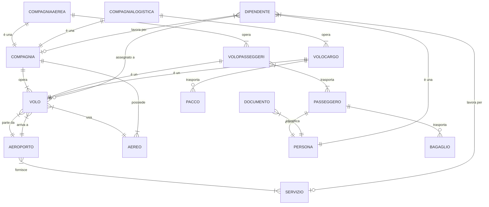
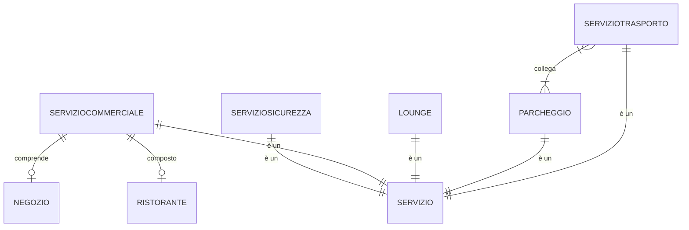

<h1 align="center"> Gestione aeroportuale </h1>

 2024-12-27 

    Diego Barbieri  
    0001080333  
    diego.barbieri5@studio.unibo.it  

    Ivan De Simone  
    0001069314  
    ivan.desimone@studio.unibo.it  

# Indice

- [Indice](#indice)
  - [Analisi dei requisiti](#analisi-dei-requisiti)
    - [Requisiti in linguaggio naturale](#requisiti-in-linguaggio-naturale)
    - [Glossario dei termini](#glossario-dei-termini)
    - [Eliminazione delle Ambiguità](#eliminazione-delle-ambiguità)
    - [Strutturazione dei requisiti](#strutturazione-dei-requisiti)
      - [*Frasi di carattere generale*](#frasi-di-carattere-generale)
      - [*Frasi relative agli aeroporti*](#frasi-relative-agli-aeroporti)
      - [*Frasi relative agli aerei*](#frasi-relative-agli-aerei)
      - [*Frasi relative ai passeggeri*](#frasi-relative-ai-passeggeri)
      - [*Frasi relative ai bagagli*](#frasi-relative-ai-bagagli)
      - [*Frasi relative ai voli passeggeri*](#frasi-relative-ai-voli-passeggeri)
      - [*Frasi relative ai voli cargo*](#frasi-relative-ai-voli-cargo)
      - [*Frasi relative ai pacchi*](#frasi-relative-ai-pacchi)
      - [*Frasi relative ai lavoratori*](#frasi-relative-ai-lavoratori)
      - [*Frasi relative ai servizi*](#frasi-relative-ai-servizi)
    - [Specifica operazioni](#specifica-operazioni)
  - [Progettazione concettuale](#progettazione-concettuale)
    - [Identificazione delle entità e relazioni](#identificazione-delle-entità-e-relazioni)
    - [Scheletro dello schema ER (approccio top-down)](#scheletro-dello-schema-er-approccio-top-down)
    - [Sviluppo delle componenti (approccio inside-out)](#sviluppo-delle-componenti-approccio-inside-out)
    - [Unione delle componenti](#unione-delle-componenti)
    - [Dizionario dei dati](#dizionario-dei-dati)
  - [Progettazione logica](#progettazione-logica)
    - [Tavole dei volumi e delle operazioni](#tavole-dei-volumi-e-delle-operazioni)
  - [Riferimenti](#riferimenti)

## Analisi dei requisiti

### Requisiti in linguaggio naturale

Si vuole realizzare una base di dati per la gestione di aeroporti, con particolare attenzione alla gestione dei voli, dei passeggeri, dei lavoratori e dei servizi connessi. Nello specifico, si vuole memorizzare informazioni riguardanti aerei di tipologie cargo e passeggeri, i voli che essi effettuano, le merci e i passeggeri che viaggiano su di essi, i lavoratori che operano negli aeroporti e i servizi offerti da questi ultimi.

Per gli aeroporti sarà necessario mantenere il codice identificativo IATA e ICAO, il nome completo, la provincia e lo stato di appartenenza, il numero di posti aereo, separati in passeggeri e cargo. Oltre a ciò è fondamentale memorizzare i servizi offerti e i servizi di sicurezza. Riguardo gli aerei si vuole memorizzare la tipologia (passeggeri o cargo), il modello, l'identificativo, la compagnia aerea che lo possiede e la capienza.

Per quanto riguarda la gestione dei voli passeggeri, si vogliono memorizzare informazioni sui passeggeri tra le quali generalità (nome, cognome, data di nascita, nazionalità, un recapito telefonico e un indirizzo email), le compagnie aeree di cui sono clienti insieme al numero di km viaggiati con esse, i loro documenti di identità registrati ed i bagagli che trasportano. I bagagli si suddividono in bagagli a mano e bagagli da stiva. Di entrambi si vuole memorizzare il peso, le dimensioni (altezza, larghezza e spessore) e lo stato (disperso, danneggiato o integro). Dei bagagli da stiva si vuole inoltre mantenere una breve descrizione e un flag se è un animale. I voli devono essere memorizzati con il numero di volo, la data e l'ora di partenza e di arrivo, la compagnia aerea che lo opera, l'aereo utilizzato, l'aeroporto di partenza e di arrivo ed il personale a bordo.

Per quello che riguarda i voli cargo, si vogliono memorizzare numero di volo, data e ora di partenza e di arrivo contestualmente all'aeroporto, la compagnia logistica che lo opera, l'aereo utilizzato, il personale a bordo ed informazioni sul carico trasportato. Nello specifico, dei singoli pacchi si vuole memorizzare il peso, dimensioni (altezza, larghezza e spessore), contenuto e stato (medesimo del bagaglio).

La base di dati deve inoltre tenere traccia di tutti i dipendenti, distinguendo tra lavoratori degli aeroporti e lavoratori delle compagnie aeree/logistiche. I lavoratori presentano generalità uguali a quelle dei passeggeri, ma si vuole memorizzare anche la compagnia per cui lavorano, il ruolo che essi ricoprono e il loro stipendio.

Tra i servizi offerti dagli aeroporti si vuole memorizzare informazioni riguardanti le lounge, i parcheggi, i ristoranti e i negozi. Delle lounge si vuole mantenere la compagnia aerea che la mette a disposizione ed i posti disponibili. Dei parcheggi si vuole memorizzare l’ubicazione, il numero di posti disponibili, il costo orario ed il numero di posti occupati. Sarà inoltre necessario salvare tutti i servizi di trasporto che collegano l'aeroporto ai servizi esterni ad esso ed alle ulteriori infrastrutture urbanistiche. Dei ristoranti e dei negozi si vuole memorizzare il nome e il tipo di cucina o merce venduta. Gli esercizi commerciali possono essere gestiti da terzi, in tal caso si vuole memorizzare il nome del gestore. Per tutti i servizi è cruciale memorizzare i dipendenti.  I servizi di sicurezza devono essere memorizzati separatamente. Più precisamente, si vuole memorizzare il nome del servizio, il tempo medio di attesa e il numero di addetti, facendo distinzione tra addetti di sicurezza e addetti di controllo.

### Glossario dei termini

| Termine | Descrizione | Sinonimi | Collegamenti | 
| --------------- | --------------- | --------------- | --------------- | 
| Aeroporto | stazione di transito di aerei| - | Volo, Lavoratore, Servizio |
| Volo | transito tra due aeroporti distinti | viaggio | Aeroporto, Aereo, Lavoratore |
| Volo passeggeri | volo che trasporta persone | - | Volo, Passeggero, Compagnia aerea |
| Passeggero | cliente per una compagnia aerea, presente su almeno un volo | cliente | Volo passeggeri, Identità |
| Bagaglio | oggetto trasportabile in una tratta aerea | valigia, borsa, zaino | Passeggero |
| Compagnia aerea | gestisce il trasporto passeggeri | - | Volo passeggeri, Aereo |
| Volo cargo | volo che trasporta merci | - | Volo, Pacco, Compagnia logistica |
| Pacco | contenitore per merci | - | Volo cargo |
| Compagnia logistica | si occupa della gestione degli aerei cargo e del trasporto merci | - | Volo cargo, Aereo |
| Aereo | mezzo di trasporto | aeromobile | Volo, Lavoratore (hostess, pilota), Aeroporto |
| Docuemento Identità | documento che può essere di diversi tipi (carta d’identità, passaporto) | documento | Passeggero, Lavoratore |
| Lavoratore | personale dell’aeroporto o di volo, tra cui piloti, hostess e steward | hostess, steward, impiegato, dipendente | Aeroporto, Volo, Compagnia, Servizio |
| Servizio di sicurezza | servizio di controllo delle attività ordinarie all'interno dell'aeroporto | controllo bagagli, controllo documenti. | Aeroporto, Lavoratore |
| Servizio commerciale | attività come ristorazione, negozi e altre strutture a servizio dei passeggeri | - | Aeroporto, Lavoratore |
| Parcheggio | area di sosta per veicoli | - | Aeroporto, Servizio di trasporto |
| Servizio di trasporto | mezzo di collegamento a servizi esterni all'aeroporto | taxi, navetta | Aeroporto, Parcheggio |

### Eliminazione delle Ambiguità

- **Parcheggi**: per ubicazione si intende longitudine e latitudine, per posti disponibili si intende il numero di posti totali, per posti occupati si intende il numero di posti attualmente occupati.
- **servizi di trasporto**: i servizi di trasporto collegano l'areoporto ad uno o più parcheggi o 
- **Voli**: si identifica con volo un singolo viaggio tra due aeroporti, con aereo l'aeromobile utilizzato per il viaggio, con compagnia la società che opera il volo, con personale a bordo i lavoratori che operano durante il volo. Voli passeggeri e voli cargo si differenziano esclusivamente per entità trasportata e compagnia di gestione.
- **Passeggeri**: il passeggero è una persona nella base di dati, che ha comprato un biglietto per un volo, ha un documento di identità e può avere zero o più bagagli.
- **Compagnia**: Non posso esistere due compagnie con lo stesso nome.

### Strutturazione dei requisiti

#### *Frasi di carattere generale*

Si vuole realizzare una base di dati per la gestione di aeroporti, con particolare attenzione alla gestione dei voli, dei passeggeri, dei lavoratori e dei servizi connessi. Nello specifico, si vuole memorizzare informazioni riguardanti aerei di tipologie cargo e passeggeri, i voli che essi effettuano, le merci e i passeggeri che viaggiano su di essi, i lavoratori che operano negli aeroporti e i servizi offerti da questi ultimi.

#### *Frasi relative agli aeroporti*

Per gli aeroporti sarà necessario mantenere il codice identificativo IATA e ICAO, il nome completo, la provincia e lo stato di appartenenza, il numero di posti aereo, separati in passeggeri e cargo. Oltre a ciò è fondamentale memorizzare i servizi offerti e i servizi di sicurezza.

#### *Frasi relative agli aerei*

Riguardo gli aerei si vuole memorizzare la tipologia (passeggeri o cargo), il modello, l'identificativo, la compagnia aerea che lo possiede e la capienza.

#### *Frasi relative ai passeggeri*

Per quanto riguarda la gestione dei voli passeggeri, si vogliono memorizzare informazioni sui passeggeri tra le quali generalità (nome, cognome, data di nascita, nazionalità, un recapito telefonico e un indirizzo email), le compagnie aeree di cui sono clienti insieme al numero di km viaggiati con esse, i loro documenti di identità registrati ed i bagagli che trasportano. 

#### *Frasi relative ai bagagli*

I bagagli si suddividono in bagagli a mano e bagagli da stiva. Di entrambi si vuole memorizzare il peso, le dimensioni (altezza, larghezza e spessore) e lo stato(disperso, danneggiato o integro). Dei bagagli da stiva si vuole inoltre mantenere una breve descrizione e un flag se è un animale.

#### *Frasi relative ai voli passeggeri*

I voli devono essere memorizzati con il numero di volo, la data e l'ora di partenza e di arrivo, la compagnia aerea che lo opera, l'aereo utilizzato, l'aeroporto di partenza e di arrivo ed il personale a bordo.

#### *Frasi relative ai voli cargo*

Per quello che riguarda i voli cargo, si vogliono memorizzare numero di volo, data e ora di partenza e di arrivo contestualmente all'aeroporto, la compagnia logistica che lo opera, l'aereo utilizzato, il personale a bordo ed informazioni sul carico trasportato.

#### *Frasi relative ai pacchi*

Nello specifico, dei singoli pacchi si vuole memorizzare il peso, dimensioni (altezza, larghezza e spessore), contenuto e stato (medesimo del bagaglio).

#### *Frasi relative ai lavoratori*

La base di dati deve inoltre tenere traccia di tutti i dipendenti, distinguendo tra lavoratori degli aeroporti e lavoratori delle compagnie aeree/logistiche. I lavoratori presentano generalità uguali a quelle dei passeggeri, ma si vuole memorizzare anche la compagnia per cui lavorano, il ruolo che essi ricoprono e il loro stipendio.

#### *Frasi relative ai servizi*

Tra i servizi offerti dagli aeroporti si vuole memorizzare informazioni riguardanti le lounge, i parcheggi, i ristoranti e i negozi.

Delle **lounge** si vuole mantenere la compagnia aerea che la mette a disposizione ed i posti disponibili. 

Dei **parcheggi** si vuole memorizzare l’ubicazione, il numero di posti disponibili, il costo orario ed il numero di posti occupati. 

Sarà inoltre necessario salvare tutti i **servizi di trasporto** che collegano l'aeroporto ai servizi esterni ad esso ed alle ulteriori infrastrutture urbanistiche.

Dei **ristoranti** e dei **negozi** si vuole memorizzare il nome e il tipo di cucina o merce venduta. Gli esercizi commerciali possono essere gestiti da terzi, in tal caso si vuole memorizzare il nome del gestore. 

I **servizi di sicurezza** devono essere memorizzati separatamente. Più precisamente, si vuole memorizzare il nome del servizio, il tempo medio di attesa e il numero di addetti, facendo distinzione tra addetti di sicurezza e addetti di controllo.

### Specifica operazioni

TODO: completare le stime

- Inserimenti
    - nuovo aeroporto (stima che dipende dal numero di aeroporti sotto lo stesso gestore)
    - nuovo volo (750 aerei al giorno)
    - nuovo aereo (100 all'anno)
    - nuovo passeggero (7 circa sette miliardi all'anno, contando duplicati)
    - nuovo lavoratore (1 volta al mese)
    - nuovo bagaglio (7 miliardi all'anno)
    - nuova compagnia aerea (1 ogni anno)
    - nuova compagnia logistica (1 ogni anno)

- Modifiche
    - esercizio commerciale aeroportuale
    - servizio di sicurezza
    - servizio di trasporto
    - volo: ritardo, cancellazione, cambio aereo
    - documenti di identità
    - stato bagaglio
    - stipendio lavoratore

- Cancellazioni
    - smantellamento aereo
    - cancellazione volo
    - invalidità documenti di identità
    - licenziamento lavoratore
    - smarrimento bagaglio

- Ricerche
    - voli in partenza
    - voli in arrivo
    - lavoratori aeroportuali
    - lavoratori compagnie aeree
    - lavoratori compagnie logistiche
    - passeggeri
    - bagagli
    - merci trasportate
    - servizi aeroportuali
    - servizi di sicurezza
    - servizi di trasporto
    - stato parcheggi

## Progettazione concettuale

### Identificazione delle entità e relazioni

Sono state identificate inizialmente le entità principali: aeroporto, aereo, volo, compagnia, persona, servizio. L'entità volo è specializzabile in volo passeggeri e volo cargo. Similmente l'entità compagnia può essere espressa come compagnia aerea e compagnia logistica. Sono state poi secondariamente identificate le entità passeggero e dipendente, derivate da persona, e le entità bagaglio e pacco. Oltre a ciò si suddividono i servizi in sicurezza, lounge, parcheggi, trasporti e commerciali.

### Scheletro dello schema ER (approccio top-down)

### Sviluppo delle componenti (approccio inside-out)

Servizi aeroportuali e servizi di sicurezza.

Voli passeggeri.

Volo e connessi (in particolare voli cargo).

### Unione delle componenti

TODO: aggiungere gli attributi (ivan)
TODO: sistemare i singoli componenti a ritroso (ivan)

Spezzato in due a "SERVIZIO" per migliorare la leggibilità

### Dizionario dei dati

| Entità | Descrizione | Attributi | Identificatore |
| --------------- | --------------- | --------------- | --------------- |
| AEROPORTO | Stazione di transito di aerei | IATA, ICAO, nome, provincia, stato, postiAereoPasseggeri, postiAereoCargo | IATA, ICAO |
| AEREO | Mezzo di trasporto | tipologia, modello, numeroDiSerie, capienza, postiPasseggeri, postiPersonale, volumeStiva | numeroDiSerie |
| VOLO | Transito tra due aeroporti distinti | numeroVolo, partenza, arriva | numeroVolo |
| PACCO | Contenitore per merci | id, peso, altezza, larghezza, spessore, contenuto, stato | id |
| COMPAGNIA | Gestisce il trasporto passeggeri | nome, sede | nome |
| PERSONA | Individuo | codiceFiscale, nome, cognome, dataNascita, numeroTelefono, email | codiceFiscale |
| DIPENDENTE | Personale dell’aeroporto o di volo | id, dataAssunzione, stipendio | id |
| DOCUMENTO | Documento di identità | tipo, numero | numero, tipo |
| PASSEGGERO | Cliente per una compagnia aerea, presente su almeno un volo | voloPasseggero, classeViaggio, numeroBiglietto, posto | numeroBiglietto |
| BAGAGLIO | Oggetto trasportabile in una tratta aerea | id, peso, altezza, larghezza, spessore, stato | id |
| SERVIZIO | Servizio aeroportuale | id, nome, descrizione, locazione | id |
| SERVIZIOSICUREZZA | Servizio di controllo delle attività ordinarie all'interno dell'aeroporto | id, tempoMedioAttesa, numeroAddetti | id |
| SERVIZIOTRASPORTO | Mezzo di collegamento a servizi esterni all'aeroporto | id, tipo, costoPerPersona | id |
| SERVIZIOCOMMERCIALE | Attività come ristorazione, negozi e altre strutture a servizio dei passeggeri | id, nome, tipo, gestore | id |
| PARCHEGGIO | Area di sosta per veicoli | id, ubicazione, postiDisponibili, costoOrario, postiOccupati | id |
| RISTORANTE | Attività commerciale di ristorazione | id, nome, tipoCucina | id |
| NEGOZIO | Attività commerciale di vendita | id, nome, tipoMerce | id |
| LOUNGE | Area di relax | id, postiDisponibili, compagnia | id |

**Associazioni** 

| Nome Relazione | Descrizione | Entità coinvolte | Attributi |
| --------------- | --------------- | --------------- | --------------- |
| VOLOPASSEGGERI | Associa un volo a dei passeggeri | VOLO(1,1) - PASSEGGERO(0,N) | - |
| VOLOCARGO | Associa un volo a dei pacchi | VOLO(1,1) - PACCO(0,N) | contenuto |
| LAVORO_SERVIZIO | Associa un dipendente a un servizio | DIPENDENTE(1,N) - SERVIZIO(0,N) | oraInizio, oraFine, mansione |
| LAVORO_VOLO | Associa un dipendente a un volo | DIPENDENTE(1,N) - VOLO(0,N) | oraInizio, oraFine, mansione |
| TRASPORTO_CARGO | Associa il trasporto di un pacco a un volo | VOLOCARGO(0,N) - PACCO(1,1) | - |
| TRASPORTO_PASSEGGERI | Associa il trasporto di un passeggero a un volo | VOLOPASSEGGERI(0,N) - PASSEGGERO(1,1) | - |
| IDENTIFICAZIONE | Associa un documento di identità a una persona | DOCUMENTO(1,1) - PERSONA(1,N) | - |
| TRASPORTO_BAGAGLIO | Associa il trasporto di un bagaglio a un passeggero | BAGAGLIO(1,1) - PASSEGGERO(1,3) | - |
| ARRIVO | Associa un volo a un aeroporto di arrivo | VOLO(1,1) - AEROPORTO(0,N) | - |
| PARTENZA | Associa un volo a un aeroporto di partenza | VOLO(1,1) - AEROPORTO(0,N) | - |
| USO_AEREO | Associa un volo a un aereo | VOLO(1,1) - AEREO(0,N) | - |
| COLLEGA | Associa un servizio di trasporto a un parcheggio | SERVIZIOTRASPORTO(0,N) - PARCHEGGIO(0,N) | - |
| FORNISCE | Associa un aeroporto a un servizio | AEROPORTO(0,N) - SERVIZIO(1,1) | - |
| OPERA | Associa una compagnia a un volo | COMPAGNIA(1,N) - VOLO(1,1) | - |

TODO: togliere Ambiguità

## Progettazione logica

### Tavole dei volumi e delle operazioni

**Tavola dei volumi** 

| Concetto | Tipo | Volume |
| --------------- | --------------- | --------------- |
| Aeroporto(Italia) | E | 126 |
| Volo | E | 115 mila |

**tavola operazioni** 

| Operazione | Frequenza |
| -------------- | --------------- |
| 1 | x Volte al y |

## Riferimenti
- [voli al giorno](https://in3giorni.com/faq/quanti-aerei-decollano-da-malpensa-ogni-giorno)
- [voli in partenza al secondo](https://www.mytripmap.it/quanti-aerei-ci-sono-ora-in-volo-mappa-in-tempo-reale/)
- [codice aeroportuale IATA](https://it.wikipedia.org/wiki/Codice_aeroportuale_IATA)
- [ER](https://mermaid.js.org/syntax/entityRelationshipDiagram.html)
- [stime in tempo reale](https://assaeroporti.com/statistiche/)
